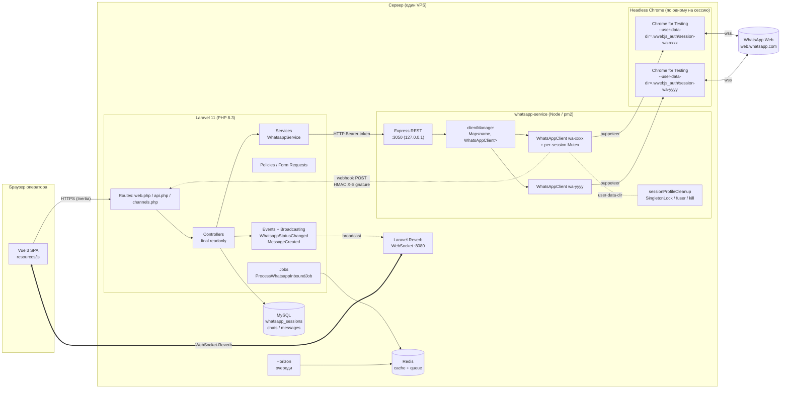
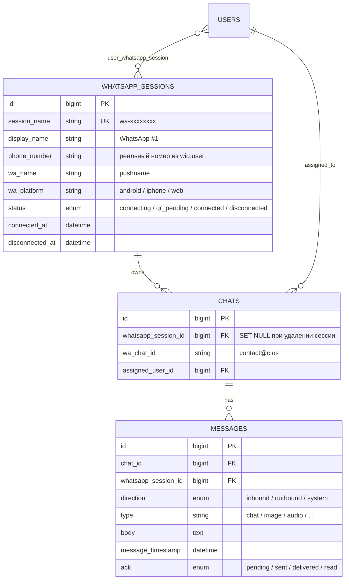
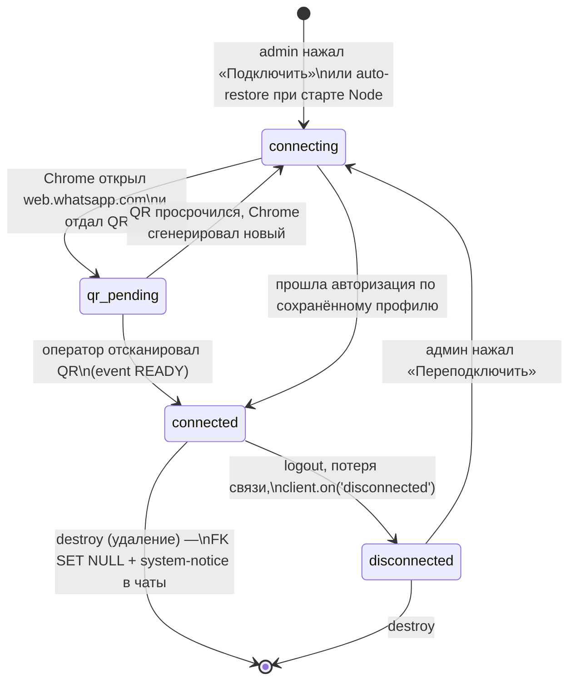
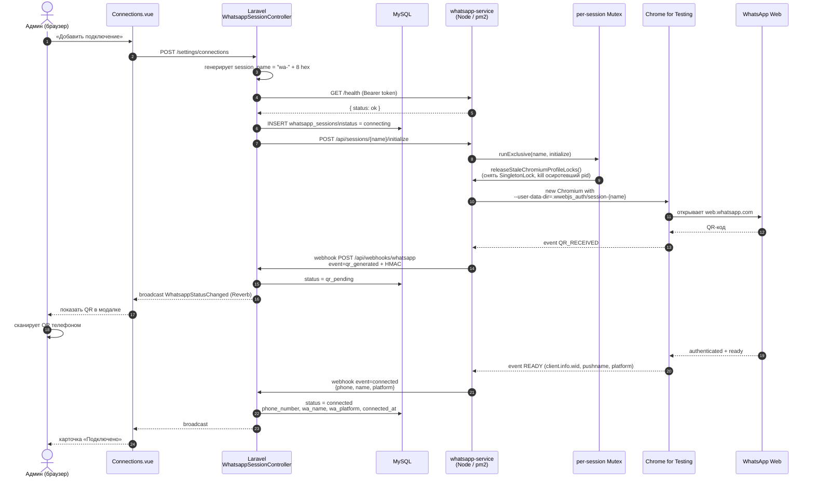
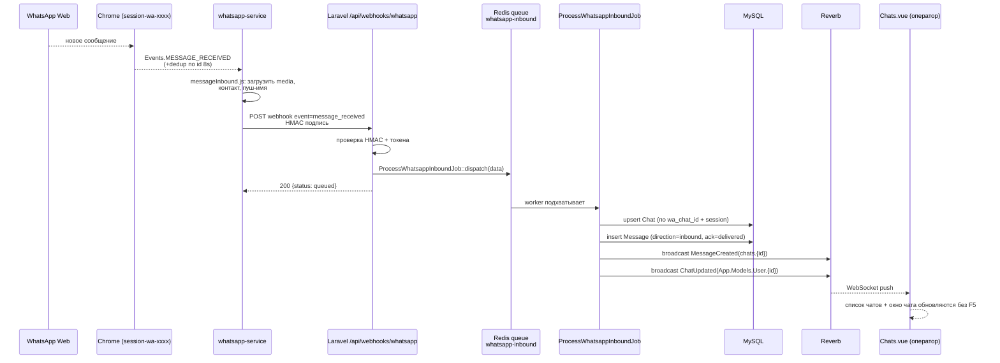
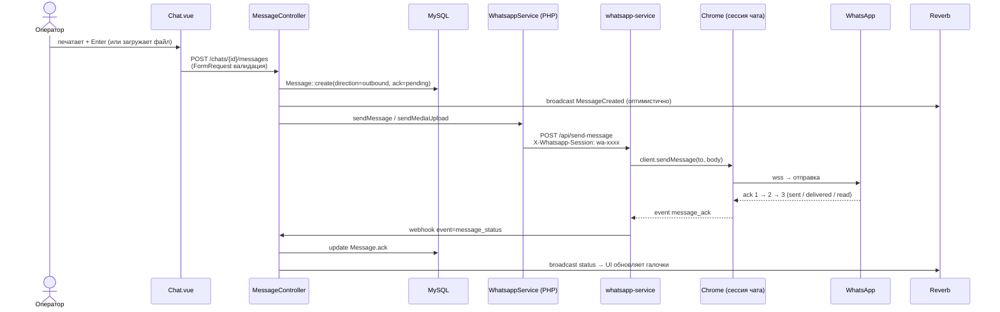
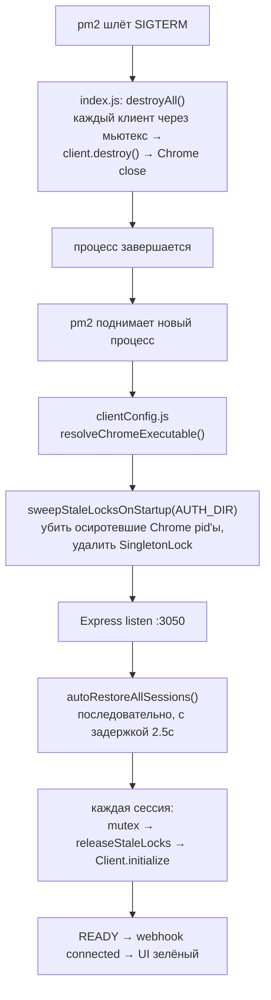

# ChatSwitch — технологическая карта

Как устроена система, как подключается номер WhatsApp, какие сервисы в этом участвуют, что лежит на диске, как идут сообщения и статусы в реальном времени.

---

## 1. Обзор стека

| Слой | Технология | Назначение |
|------|------------|------------|
| Frontend (SPA) | Vue 3 + Inertia.js + TypeScript + Vite | `resources/js` — все страницы и компоненты |
| Backend | Laravel 11, PHP 8.3+ | Контроллеры, сервисы, очереди, политики |
| Realtime | Laravel Reverb (WebSocket) | Приватные каналы `App.Models.User.{id}` и `chats.{id}` |
| БД | MySQL 8 (SQLite в тестах) | `whatsapp_sessions`, `chats`, `messages`, `users`, `roles` |
| Кэш / очереди / сессии | Redis + Laravel Horizon | Очередь `whatsapp-inbound`, мониторинг |
| WhatsApp‑мост | Node.js микросервис `whatsapp-service` на `whatsapp-web.js` | По одному Chromium‑клиенту на сессию |
| Браузер | Chrome for Testing (`~/.cache/puppeteer/chrome/linux-*`) | Headless, НЕ snap — чтобы уважал `--user-data-dir` |
| Управление процессами | pm2 | `chatswitch-whatsapp` под pm2 |

---

## 2. Карта компонентов



---

## 3. Справочник портов и путей

| Ресурс | Где |
|--------|-----|
| Публичный HTTPS Laravel | `https://chatswitch.10k.kz/` |
| Reverb WebSocket | `:8080` (через reverse‑proxy) |
| whatsapp-service REST | `http://127.0.0.1:3050` (только loopback) |
| Chrome‑бинарник | `/root/.cache/puppeteer/chrome/linux-146.0.7680.153/chrome-linux64/chrome` |
| Профили сессий | `/var/www/chatswitch.10k.kz/whatsapp-service/.wwebjs_auth/session-<name>/` |
| web‑version cache | `/var/www/chatswitch.10k.kz/whatsapp-service/.wwebjs_cache/<name>/` |
| Логи Node | `/var/www/chatswitch.10k.kz/whatsapp-service/logs/{out,error}.log` |
| pm2 app | `chatswitch-whatsapp` |

Laravel ↔ Node общаются по REST: `Bearer <WHATSAPP_SERVICE_TOKEN>` в обе стороны. Входящие webhook‑и от Node дополнительно подписываются HMAC (`X-Signature`).

---

## 4. Модель данных (ключевые таблицы)



`whatsapp_session_id` на `chats` и `messages` — `SET NULL`, поэтому удаление сессии не ломает историю: перед удалением в каждый чат добавляется системное сообщение «📵 Номер отключён».

---

## 5. Жизненный цикл сессии WhatsApp



Состояние `whatsapp_sessions.status` синхронизируется двумя путями:

1. **Node → Laravel webhook** (мгновенно): `connected`, `disconnected`, `qr_generated`, `auth_failure`, `message_received`, `message_status`.
2. **Laravel → Node REST** (при заходе на страницу `/settings/connections` и периодическом polling через `useSessionStatus`): `GET /api/sessions/:name/status` → контроллер `reconcileSessionsWithMicroservice()` приводит БД в соответствие.

---

## 6. Как подключается новый номер (пошагово)



Ключевые защиты от ошибки «The browser is already running…»:

- **Per‑session Mutex** (`sessionMutex.js`) — параллельные вызовы `initialize/destroy/logout` на одну сессию выстраиваются в очередь.
- **`releaseStaleChromiumProfileLocks`** — перед каждым `initialize` читает PID из `SingletonLock` (symlink `host-PID`), если процесс мёртв → удаляет lock, если жив‑осиротевший → `process.kill(-9)` + `fuser -k`.
- **`_hardDestroyClient`** — на `destroy/logout` с таймаутом 8 с; если зависло — `pupBrowser.process().kill('SIGKILL')`.
- **`sweepStaleLocksOnStartup`** — при старте Node обходит все `session-*` и снимает осиротевшие локи от упавшего предыдущего процесса.

Подробности про то, почему нельзя использовать `/usr/bin/chromium-browser` (snap): см. раздел 11.

---

## 7. Входящее сообщение (Inbox)



Очередь нужна, чтобы Node не ждал медленных операций (медиа, выборка контактов, broadcasting) — webhook возвращает `200 queued` за миллисекунды.

---

## 8. Исходящее сообщение



---

## 9. Realtime каналы (Reverb)

| Канал | Тип | Кто может подписаться | Что транслируется |
|-------|-----|------------------------|-------------------|
| `App.Models.User.{id}` | private | только сам пользователь | список его чатов (`ChatUpdated`), статусы его сессий (`WhatsappStatusChanged`) |
| `chats.{chatId}` | private | админ/менеджер всегда, сотрудник — если `assigned_user_id = id` | `MessageCreated`, `MessageUpdated`, `TypingStarted` |

Авторизация каналов — `routes/channels.php`, защищена политиками (`ChatPolicy`). Фронт подписывается через `resources/js/echo.ts`.

---

## 10. Файловая система одной сессии

```
whatsapp-service/
├── .wwebjs_auth/
│   └── session-wa-xxxxxxxx/       ← user-data-dir Chromium
│       ├── Default/                 cookies, local storage (авторизация WhatsApp)
│       ├── SingletonLock            symlink "host-<pid>" пока Chrome жив
│       ├── SingletonCookie
│       ├── SingletonSocket
│       └── ...
├── .wwebjs_cache/
│   └── wa-xxxxxxxx/                 web.js кэш версии WhatsApp Web (отдельный на сессию)
└── logs/
    ├── out.log
    └── error.log
```

Полный сброс авторизации конкретного номера — `rm -rf .wwebjs_auth/session-<name>` при остановленной сессии. Затем `POST /api/sessions/<name>/initialize` выдаст новый QR.

---

## 11. Почему именно Chrome for Testing, а не snap Chromium

Snap‑версия `/usr/bin/chromium-browser` **игнорирует** переданный `--user-data-dir` (AppArmor принудительно подменяет профиль на `/root/snap/chromium/common/chromium`). В результате все WhatsApp‑сессии конкурируют за один профиль и со второй получаем:

```
The browser is already running for .../session-wa-xxxx.
Use a different `userDataDir` or stop the running browser first.
```

Поэтому `whatsapp-service/src/whatsapp/clientConfig.js::resolveChromeExecutable()`:

1. Если `PUPPETEER_EXECUTABLE_PATH` задан и не snap и существует — берёт его.
2. Иначе — последняя версия `~/.cache/puppeteer/chrome/linux-*` (скачивает Puppeteer).
3. Иначе — `/usr/bin/google-chrome-stable` / `/usr/bin/google-chrome`.
4. Snap‑пути игнорируются с warning'ом в лог.

Восстановить скачанный Chrome, если кэш очистили:

```bash
cd /var/www/chatswitch.10k.kz/whatsapp-service
npx @puppeteer/browsers install chrome@stable
pm2 restart chatswitch-whatsapp
```

---

## 12. Что происходит при `pm2 restart chatswitch-whatsapp`



---

## 13. Безопасность и разграничение

| Проверка | Где |
|----------|-----|
| Bearer `WHATSAPP_SERVICE_TOKEN` | middleware Express в Node и заголовок Laravel `WhatsappService` |
| HMAC webhook | Node подписывает payload `X-Signature`, Laravel сверяет в `VerifyWhatsappWebhook` middleware |
| Политики доступа | `ChatPolicy`, `WhatsappSessionPolicy` — менеджер/сотрудник/админ |
| Приватные каналы | `routes/channels.php` + policies |
| EnsureActiveUser | middleware на web‑группе — деактивированный юзер разлогинивается автоматически |
| FormRequest валидация | все mutating endpoint'ы в `App\Http\Requests\...` |
| Диагностика сессии | `WhatsappSessionController::diagnostics` требует `manage` policy (только админ) |

---

## 14. Операционные команды (шпаргалка)

```bash
# Статус сервиса
pm2 status
pm2 logs chatswitch-whatsapp --lines 50

# Рестарт с применением ecosystem.config.js
cd /var/www/chatswitch.10k.kz/whatsapp-service
pm2 delete chatswitch-whatsapp
pm2 start ecosystem.config.js
pm2 save

# Горизонт (очереди Laravel)
php artisan horizon:status
php artisan queue:restart

# Полный сброс одного номера (делать при остановленной сессии!)
curl -s -X POST -H "Authorization: Bearer $TOKEN" \
  http://127.0.0.1:3050/api/sessions/wa-xxxxxxxx/destroy
rm -rf .wwebjs_auth/session-wa-xxxxxxxx
# затем в UI — «Переподключить»

# Проверить живой ли Chrome для сессии
ps -ef | grep "user-data-dir=.*session-wa-xxxxxxxx"

# Быстрая диагностика из UI
# /settings/connections → «Подробности» у нужной сессии
```

---

## 15. Масштабирование (growing 5–30 номеров, десятки операторов)

- **Один VPS, один `whatsapp-service`**, несколько клиентов в одном Node процессе — нормально до ~30 сессий (память ~150–250 МБ на Chrome).
- Вертикально: поднять `--max-old-space-size` у Node и выделить больше RAM под Chrome‑ы.
- Горизонтально: разнести часть сессий в отдельный инстанс `whatsapp-service` (своя папка `.wwebjs_auth`, свой порт, свой токен) — Laravel выбирает инстанс по `session_name` (сейчас используется единственный base URL; при необходимости добавить маршрутизацию в `WhatsappService`).
- Очередь и broadcasting уже отвязаны — можно запускать Horizon с несколькими воркерами и Reverb с кластером.

---

Если правите архитектуру — обновляйте этот файл. Он держит «карту» кодовой базы и спасает от регресса по тем же граблям (snap Chromium, stale SingletonLock, гонки на `initialize`).
