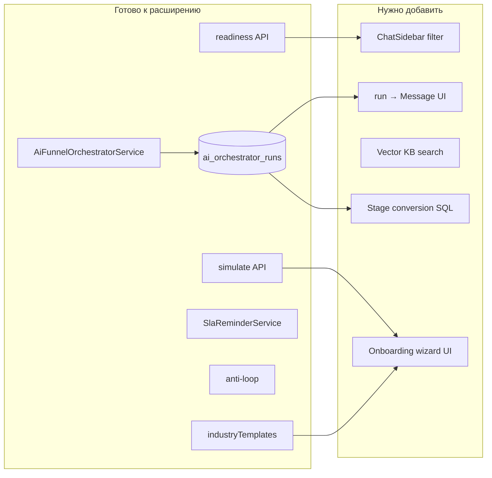

# Roadmap: UX / UI / Оптимизации — аудит готовности

**Дата аудита:** 18 мая 2026  
**Репозиторий:** `/var/www/chatswitch.10k.kz`  
**Легенда статусов:**

| Статус | Значение |
|--------|----------|
| ✅ Готово | Реализовано end-to-end (backend + UI, где нужно) |
| 🟡 Частично | Есть ядро, но не дотягивает до спецификации |
| 🔵 В разработке | Заложено в коде, UI/интеграция не завершены |
| ⬜ Осталось | Не найдено или только заготовки |

**Сводка (после спринта 18.05.2026):** ✅ 23 · 🟡 6 · ⬜ 1

**Сделано в этом спринте:** P0 + P1 + конверсия воронки + **авто follow-up** + **skeleton настроек** (`SettingsContentSkeleton` в `SettingsLayout`) + **CRM-блок карточки контакта** (`ContactCardCrmService`, `ContactCrmSections.vue`).

---

## 10 UX улучшений

| # | Функция | Статус | Что есть | Что осталось |
|---|---------|--------|----------|--------------|
| 1 | Онбординг новой компании (WhatsApp → сотрудники → отделы → AI → воронки → БЗ) | ✅ | `OnboardingController` + `Settings/Onboarding.vue`: 8 шагов, прогресс %, ссылки в разделы, readiness. `CompanyOnboardingService` при регистрации. | Нет блокировки функций до завершения шагов (мягкий wizard). |
| 2 | «Проверка готовности AI» | ✅ | `AiInsightsController::readiness()`, экран `Settings/AiQuality.vue`: score %, checks (WhatsApp, сотрудники, отделы, воронка, сценарии, правила этапов, БЗ, каталог), next_actions. Баннер в `Chats/Show.vue` при score &lt; порога для `manageAi`. | — |
| 3 | Симулятор клиента | ✅ | `AiSimulationService`, `settings/ai-quality/simulate`, `POST chats/{chat}/ai-simulate`, модалка `AiSimulatorModal` в `ChatHeader` (контекст чата + история). | Нет анимированного preview смены этапа воронки после симуляции. |
| 4 | История решений AI в чате | ✅ | `MessageAiDecisionService` → `ai_decision` на bubble в `ChatMessage.vue`; также history в сайдбаре/панели AI. | Нет раскрытия полного plan JSON. |
| 5 | Быстрые действия в шапке чата | ✅ | `ChatHeader.vue`: AI, этап, назначение, отделы + кнопка **«Задача»**. | — |
| 6 | Предупреждения перед опасными настройками | ✅ | `AiReadinessService` + подтверждение при включении AI (`ChatAiSettingsController`). Модалка в `ChatHeader.vue` при низкой готовности + ссылка на AI Quality. | Другие `window.confirm` в приложении. |
| 7 | Умные подсказки в настройках воронки | ✅ | `funnelStageHints.ts` + чипы на карточке этапа в `Funnels.vue` (цель, переход, 2–3 вопроса, follow-up). `suggestedStageRule()` и audit в AI Quality. | — |
| 8 | Фильтр «требует внимания» | ✅ | `ChatAttentionService`, таб **«Внимание»** в `ChatSidebar`, `?filter=attention`. | Нет «AI uncertain», «спорная оплата», «неизвестный срок». |
| 9 | Мягкое ручное вмешательство | 🟡 | Режим `ai_mode: draft`, `draft_reply` → `ChatInput`. `AiDraftToneLearningService` + toast в чате при сильной правке черновика. Подсказка под черновиком в `AiAssistantPanel.vue`. | Учёт лёгких правок (пунктуация). |
| 10 | Единая карточка клиента | 🟡 | `ContactController::card()` + `ContactCardCrmService`: сделка (воронка/этап/AI/ответственные), компании, события, задачи, факты. UI: `ContactCrmSections.vue` в чате и «Клиенты». | Нет заказов, оплат, доставок (нет модели в системе). |

---

## 10 UI улучшений

| # | Функция | Статус | Что есть | Что осталось |
|---|---------|--------|----------|--------------|
| 11 | Унифицировать страницы настроек | ✅ | `SettingsLayout.vue` + `SettingsSidebar`; основные разделы настроек. `Channels/Index.vue` и **`Status/Index.vue`** — те же CTA (чаты / подключения), без отдельного settings-shell. | Полное внесение демо-страниц в `SettingsLayout`. |
| 12 | Шкала воронки в шапке чата | ✅ | `ChatHeader.vue`: полоска этапов, текущий/следующий, `funnelProgressPercent`, цвет этапа. `ContactInfoPanel`: progress bar %. | «Красивая» шкала — субъективно; можно улучшить визуал next-stage label. |
| 13 | Бейдж AI-статуса | ✅ | Pills в header: orchestrator (running, needs_manager, failed), aiStatus (generating, blocked, drafted…), режим AI. `ContactInfoPanel` deal-card tone. | Не все 5 статусов из ТЗ в одном компактном badge (ждёт данных / ошибка / выключен — разнесены). |
| 14 | Карточки сообщений AI | ✅ | Badge «(AI)», feedback, карточка `ai_decision` с reason и chips. | — |
| 15 | Конструктор воронки drag-and-drop | ✅ | API `reorderStages`, native HTML5 DnD + кнопки ↑↓ в `Funnels.vue`. | — |
| 16 | Иконки этапов (лид, оплата, доставка…) | ✅ | `funnel_stages.stage_type` + `FunnelStageIcon.vue` (8 типов). Выбор в `Funnels.vue`, барабан и снимок сделки в `ChatHeader`, CRM-карточка. Авто-подбор по названию (`FunnelStageType::guessFromName`). | — |
| 17 | Полезные пустые состояния | ✅ | Funnels, KnowledgeBase, AiQuality, Clients, **Channels**, **Status** — empty-first и CTA. | Редкие вложенные экраны без CTA. |
| 18 | Компактный правый сайдбар чата | ✅ | `ContactInfoPanel`: клиент, AI/deal card, воронка %, задачи, события календаря (`sidebarInsights`). | «Компактность» — на усмотрение; панель объёмная, не отдельный узкий rail. |
| 19 | Цветовая система | ✅ | `resources/css/app.css`: `--ui-bg`, `--ui-accent`, surfaces, borders; light/dark. Semantic tones в карточках (warning, success). | Полный design-token guide не документирован; часть страниц ещё на `--wa-*`. |
| 20 | Skeleton loading | ✅ | `SkeletonBlock.vue`, `ChatSidebar` при `loadingMore`, overlay `SettingsContentSkeleton` при навигации в `SettingsLayout`, `ContactCardSkeleton` при загрузке карточки. | — |

---

## 10 оптимизаций и нового функционала

| # | Функция | Статус | Что есть | Что осталось |
|---|---------|--------|----------|--------------|
| 21 | Шаблоны отраслевых воронок | ✅ | 7 шаблонов, включая **«Мебель / кухни»** в `FunnelController::industryTemplates()`. | — |
| 22 | Автогенерация воронки по описанию бизнеса | ✅ | `FunnelAiWizard.vue`, `POST settings/funnels/ai-onboarding-suggest`, `FunnelAiSuggestionService`. Тесты `FunnelAiOnboardingTest`. | — |
| 23 | Автоаудит базы знаний (противоречия, дубли, цены) | 🟡 | Эвристики + опциональный **`KnowledgeCatalogLlmAuditService`** (чекбокс «AI-анализ»). API `catalog-audit?llm=1`. Cron `knowledge:catalog-audit` в `routes/console.php` (воскресенье 03:05, только эвристики, лог). | Сверка цен с историей чатов. |
| 24 | RAG-поиск по БЗ | ✅ | `knowledge_chunks`, indexer/retriever, fallback на полный дамп, `PromptBuilder` с вопросом клиента; UI: переиндексация, тест вопроса, подсказка «каталог изменён» после правок. Cron `knowledge:index-embeddings` в `routes/console.php` (04:30, при `KNOWLEDGE_RAG_ENABLED`). | — |
| 25 | Антизацикливание AI | ✅ | `AiFunnelOrchestratorService::normalizeRepeatedQuestion()` — similarity ≥0.72 → stop + задача менеджеру. | — |
| 26 | SLA и напоминания | ✅ | `SlaReminderService`, cron `chats:sla-reminders`, organization posts. **`SlaReminderSettings`** + блок «SLA в чатах» в `Settings/System.vue` (вкл/выкл, 5–120 мин). | — |
| 27 | Автоматические follow-up | ✅ | `FunnelStageFollowUpService`: правила на этапе (`follow_up_*`), cron каждые 15 мин → `ScheduledMessage` (`funnel_follow_up`), отмена при ответе клиента / смене этапа. UI в `Funnels.vue`. | Нет A/B шаблонов и AI-генерации текста follow-up. |
| 28 | Аналитика воронки (конверсия, отвал, время ответа) | ✅ | `FunnelConversionAnalyticsService` + `chat_funnel_transitions`: входы на этап, переход дальше, отвал, ср. время на этапе, сквозная конверсия. UI во вкладке «Воронки» в `Analytics/Dialogs.vue`. | Отдельный avg response time AI vs менеджер на этапе. |
| 29 | Обучение на правках менеджера | 🟡 | `ToneProfileAnalyzer`, cron, human outbound. **`AiDraftToneLearningService`**: при отправке сильно изменённого `draft_reply` → jobs tone profile. | Suggestions в UI tone/profile; учёт лёгких правок (пунктуация). |
| 30 | *(в списке 9 пунктов оптимизаций — п.30 отсутствует в исходном ТЗ)* | — | — | — |

---

## Приоритетный backlog

### P0 — доверие к AI и операционка

1. **Фильтр «Требует внимания» в `ChatSidebar`** — переиспользовать `attentionQueue()`, расширить критерии (low confidence из run).
2. **Gate при включении AI** — если readiness &lt; порога или нет БЗ/ответственного → confirm + ссылка на AI Quality.
3. **История решения у сообщения** — `GET` run by `trigger_message_id`, блок под AI-bubble в `ChatMessage.vue`.

### P1 — UX по спецификации

4. ~~**Onboarding wizard**~~ — `settings/onboarding`.
5. ~~**Симулятор в чате**~~ — `AiSimulatorModal` + `chats.ai-simulate`.
6. ~~**«Создать задачу» в header**~~ — кнопка в `ChatHeader`.
7. ~~**DnD этапов**~~ — native DnD в `Funnels.vue`.
8. ~~**Skeleton**~~ — `SettingsContentSkeleton` в `SettingsLayout`.

### P2 — дифференциация

9. **RAG** — embeddings + retrieval service.
10. **CRM-карточка** — заказы/оплаты при появлении модели; расширить факты (RAG, интеграции).
11. ~~**Шаблон «Мебель»** + иконки этапов~~ — `stage_type` + `FunnelStageIcon`.
12. ~~**Конверсионная аналитика воронки**~~ — `FunnelConversionAnalyticsService`.
13. ~~**Auto follow-up**~~ — `funnel-follow-ups:schedule` + настройки этапа.

---

## Карта переиспользования (уже в коде)

---

## Оценка трудозатрат (1 разработчик)

| Задача | S (1–3 дн) | M (1–2 нед) | L (3+ нед) |
|--------|:----------:|:-----------:|:----------:|
| Фильтр внимания в чатах | | ✓ | |
| Confirm AI + readiness gate | ✓ | | |
| AI decision на сообщении | | ✓ | |
| DnD воронки | ✓ | | |
| Onboarding wizard UI | | | ✓ |
| RAG | | | ✓ |
| Конверсия воронки | | ✓ | |
| CRM-карточка | | | ✓ |

---

## Ключевые файлы (reference)

| Область | Пути |
|---------|------|
| AI Quality / readiness / simulate / attention | `app/Http/Controllers/AiInsightsController.php`, `resources/js/Pages/Settings/AiQuality.vue` |
| Оркестратор / anti-loop | `app/Services/AI/AiFunnelOrchestratorService.php` |
| Чат header / воронка / AI | `resources/js/Pages/Chats/Partials/ChatHeader.vue` |
| Правый сайдбар | `resources/js/Pages/Chats/Partials/ContactInfoPanel.vue` |
| Шаблоны воронок | `app/Http/Controllers/FunnelController.php` → `industryTemplates()` |
| AI-генерация воронки | `resources/js/Pages/Settings/Partials/FunnelAiWizard.vue` |
| SLA | `app/Services/SlaReminderService.php` |
| Tone | `app/Services/AI/ToneProfileAnalyzer.php` |
| Settings layout | `resources/js/Layouts/SettingsLayout.vue` |
| Design tokens | `resources/css/app.css` |

---

*Документ сгенерирован по аудиту кодовой базы. При изменениях в репозитории обновите статусы вручную или запросите повторный аудит.*
