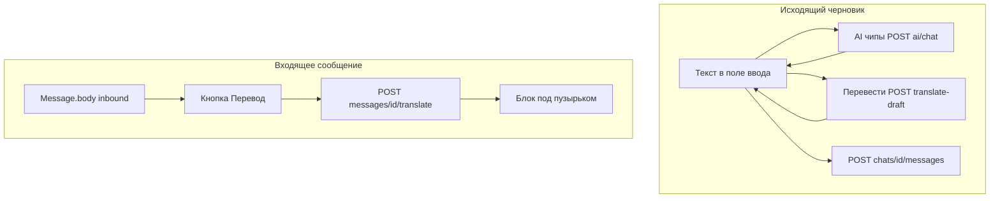

# Перевод сообщений и AI-подсказки в чате (веб + Mobile API)

**Дата:** 2026-06-04  
**Аудитория:** Flutter, backend, QA

Документ описывает, как на веб-CRM устроены **чипы над полем ввода** (Перевести, Ответить, Улучшить текст, …), **перевод исходящего черновика** и **перевод входящих сообщений**, и как то же подключить в мобильном приложении через `/api/v1`.

Связанные файлы:

- Веб UI: [`resources/js/Pages/Chats/Partials/ChatInput.vue`](../../resources/js/Pages/Chats/Partials/ChatInput.vue), [`ChatMessage.vue`](../../resources/js/Pages/Chats/Partials/ChatMessage.vue), [`AiAssistantPanel.vue`](../../resources/js/Pages/Chats/Partials/AiAssistantPanel.vue)
- Backend: [`ChatAiAssistantController`](../../app/Http/Controllers/ChatAiAssistantController.php), [`MessageTranslationController`](../../app/Http/Controllers/MessageTranslationController.php), [`ChatDraftTranslationController`](../../app/Http/Controllers/ChatDraftTranslationController.php)
- Mobile routes: [`routes/api-tenant.php`](../../routes/api-tenant.php)
- OpenAPI (частично): [`openapi/mobile-v1.yaml`](../../openapi/mobile-v1.yaml) — схемы `AiChatRequest` / `AiChatResponse`

---

## Содержание

1. [Обзор: три разные функции](#1-обзор-три-разные-функции)
2. [Настройка «перевод включён»](#2-настройка-перевод-включён)
3. [AI-подсказки над полем ввода (чипы)](#3-ai-подсказки-над-полем-ввода-чипы)
4. [Перевод исходящего черновика (кнопка «Перевести»)](#4-перевод-исходящего-черновика-кнопка-перевести)
5. [Перевод входящих сообщений](#5-перевод-входящих-сообщений)
6. [Боковая панель AI-ассистента (веб)](#6-боковая-панель-ai-ассистента-веб)
7. [Сводка Mobile API](#7-сводка-mobile-api)
8. [Внедрение во Flutter](#8-внедрение-во-flutter)
9. [Отличия от AI toggle и AI workspace tab](#9-отличия-от-ai-toggle-и-ai-workspace-tab)

---

## 1. Обзор: три разные функции

| Функция | Где в UI | Что делает | Сохраняется в БД? |
|---------|----------|------------|-------------------|
| **AI-чипы** | Строка над полем ввода | OpenAI переписывает/генерирует **черновик ответа** оператора | Нет — только подставляет текст в поле ввода |
| **Перевести (черновик)** | Чип «Перевести» | Переводит **текст в поле ввода** на язык клиента | Нет |
| **Перевод входящего** | Кнопка на пузырьке inbound | Переводит **тело сообщения клиента** на язык интерфейса | Нет — кеш в `localStorage` на вебе |

Все три используют OpenAI через backend, но **разные endpoints** и промпты.



---

## 2. Настройка «перевод включён»

### Веб

- Composable [`useTranslationLang`](../../resources/js/composables/useTranslationLang.ts):
  - `translate_enabled` — boolean в `localStorage` (`accel.settings.translate_enabled`), переключатель в профиле → раздел чатов [`ChatsSection.vue`](../../resources/js/Pages/Profile/Partials/ChatsSection.vue).
  - **Целевой язык перевода входящих** = язык интерфейса (`ru` | `kk` | `en` | `zh` | `tr` | `ar`), не отдельная настройка.

### Логика показа кнопок

| UI | Условие |
|----|---------|
| Чип «Перевести» над вводом | `translate_enabled` **и** не групповой чат **и** есть текст **и** язык черновика ≠ язык клиента |
| Кнопка «Перевод» на сообщении | `translate_enabled` **и** inbound **и** текст достаточной длины **и** язык сообщения ≠ `targetLang` |

Эвристика языка (клиент / сообщение): [`resources/js/utils/messageLanguage.ts`](../../resources/js/utils/messageLanguage.ts) — зеркало backend [`MessageLanguageHeuristics`](../../app/Support/MessageLanguageHeuristics.php).

**Язык клиента для исходящего перевода** на вебе считается на клиенте из последних 20 inbound в [`Show.vue`](../../resources/js/Pages/Chats/Show.vue) (`detectClientLanguage`) и передаётся в `ChatInput` как `client-language`. Backend при `translate-draft` может **пересчитать** язык сам через [`ChatClientLanguageService`](../../app/Services/AI/ChatClientLanguageService.php), если `lang` не передан.

### Flutter

- Хранить `translate_enabled` локально (аналог веба).
- `targetLang` = locale приложения (`ru` / `kk` / …).
- `clientLanguage`: либо `detectClientLanguage` на последних N inbound из `GET /chats/{id}/messages`, либо отдельный API (сейчас **нет** — дублируйте эвристику на клиенте, как в `messageLanguage.ts`).

---

## 3. AI-подсказки над полем ввода (чипы)

### Веб-поведение

Файл: [`ChatInput.vue`](../../resources/js/Pages/Chats/Partials/ChatInput.vue) — блок `.wa-ai-input-actions`.

| Чип | Ключ | Нужен текст в поле? | Что отправляется в API |
|-----|------|---------------------|-------------------------|
| **Ответить** | `reply` | Нет | Промпт: «Подготовь один готовый ответ клиенту…» |
| **Улучшить текст** | `improve` | Да | «Улучши этот ответ…» + текущий черновик |
| **Сделать короче** | `shorter` | Да | «Сделай короче…» + черновик |
| **Сделать вежливее** | `polite` | Да | «Сделай вежливее…» + черновик |

Точные тексты промптов: [`chats.ru.ts`](../../resources/js/i18n/messages/domains/chats.ru.ts) → `chats.input.aiPromptReply`, `aiPromptImprove`, `aiPromptShorter`, `aiPromptPolite`.

**Запрос (веб и mobile — один endpoint):**

```http
POST /api/v1/chats/{chat}/ai/chat
Authorization: Bearer {token}
Content-Type: application/json

{
  "message": "Улучши этот ответ оператору: ...\n\n{текущий черновик}",
  "history": []
}
```

Для чипов веб всегда шлёт `history: []`. Панель AI-ассистента (см. §6) передаёт накопленную `history`.

**Ответ 200:**

```json
{
  "reply": "Готовый текст для вставки в поле ввода",
  "product": {
    "id": 12,
    "name": "Товар",
    "..."
  }
}
```

- `reply` — подставляется в поле ввода (заменяет черновик).
- `product` — опционально; если AI вернул маркер товара из каталога, веб прикрепляет товар к отправке (`product_id` при `POST .../messages`). На mobile можно игнорировать до поддержки каталога.

**Ошибки:**

| HTTP | Тело | Когда |
|------|------|-------|
| 403 | — | Нет `view` на чат |
| 429 | — | > 30 запросов/мин на user |
| 502 | `{ "message": "...", "technical_error": "..." }` | OpenAI / конфиг (admin видит `technical_error`) |
| 500 | `{ "message": "..." }` | Прочие сбои |

**Backend:** [`ChatAiAssistantController::chat`](../../app/Http/Controllers/ChatAiAssistantController.php) → [`ChatAssistantService::reply`](../../app/Services/AI/ChatAssistantService.php):

- В system попадают последние **80** сообщений чата из БД, база знаний, календарь оператора, профиль языка клиента.
- Ответ оператору на **русском**; черновик **для клиента** — на языке клиента (см. system prompt).

**Throttle (mobile):** `throttle:30,1` в [`routes/api-tenant.php`](../../routes/api-tenant.php).

### Flutter — чипы

1. Над `TextField` — `Wrap` с кнопками (как на скриншоте).
2. По тапу — `POST /api/v1/chats/{chatId}/ai/chat` с `message` = промпт из таблицы выше (локализуйте строки как на вебе).
3. `reply` → `TextEditingController.text = reply`.
4. Блокируйте чипы при `isLoading`; показывайте ошибку из `message`.
5. **Не путать** с `PATCH /chats/{id}/ai` (toggle автоответа) и с `POST /ai-chat/query` (вкладка AI workspace).

---

## 4. Перевод исходящего черновика (кнопка «Перевести»)

### Веб-поведение

Тот же ряд чипов, отдельная кнопка с классом `wa-draft-translate-chip`.

```http
POST /chats/{chat}/translate-draft
```

(session, **не** `/api/v1` на вебе)

**Body:**

```json
{
  "text": "привет",
  "lang": "kk"
}
```

| Поле | Обязательно | Описание |
|------|-------------|----------|
| `text` | да | Черновик оператора, max 4000 |
| `lang` | нет | Целевой язык; если omitted — [`ChatClientLanguageService::resolveOutgoingTarget`](../../app/Services/AI/ChatClientLanguageService.php) |

**Поддерживаемые `lang`:** `ru`, `kk`, `en`, `zh`, `tr`, `ar`.

**Ответ 200:**

```json
{
  "translation": "Сәлеметсіз бе",
  "target_lang": "kk",
  "target_label": "казахский",
  "unchanged": false
}
```

Если перевод не нужен (язык совпадает):

```json
{
  "translation": "привет",
  "target_lang": "kk",
  "target_label": "казахский",
  "unchanged": true
}
```

**Ошибки:** 503 `{ "error": "Сервис перевода недоступен." }`, 403 без доступа к чату.

**Throttle (веб):** `throttle:chat-translate` — 30 req/min per user.

### Mobile API — пробел

| Endpoint | В `/api/v1` |
|----------|-------------|
| `POST /chats/{chat}/translate-draft` | **Нет** (только [`routes/tenant.php`](../../routes/tenant.php)) |
| `POST /messages/{message}/translate` | **Есть** |

**Варианты для Flutter:**

1. **Рекомендуется:** добавить на backend зеркало  
   `POST /api/v1/chats/{chat}/translate-draft` → тот же [`ChatDraftTranslationController::translate`](../../app/Http/Controllers/ChatDraftTranslationController.php), throttle `chat-translate` или `30,1`.
2. **Временно:** не показывать чип «Перевести» до появления маршрута.
3. **Не использовать** `messages/{id}/translate` для черновика — другой контракт и привязка к `Message`.

### Flutter — после появления API

```dart
final response = await api.post(
  '/chats/$chatId/translate-draft',
  data: {
    'text': controller.text.trim(),
    if (targetLang != null) 'lang': targetLang,
  },
);
final translation = response.data['translation'] as String;
if (response.data['unchanged'] != true) {
  controller.text = translation;
}
```

`targetLang` = результат `resolveOutgoingTargetLanguage(draft, clientLanguage)` (порт [`messageLanguage.ts`](../../resources/js/utils/messageLanguage.ts)).

---

## 5. Перевод входящих сообщений

### Веб-поведение

Файл: [`ChatMessage.vue`](../../resources/js/Pages/Chats/Partials/ChatMessage.vue).

- Кнопка «Перевод» только на **inbound**, если включён перевод и `messageNeedsTranslation(body, targetLang)`.
- По тапу — показ блока под сообщением; перевод **не** пишется в БД.
- Кеш: `localStorage` ключ `accel.translation.{messageId}.{lang}`.

**Запрос (есть в Mobile API):**

```http
POST /api/v1/messages/{message}/translate
Authorization: Bearer {token}
Content-Type: application/json

{
  "lang": "ru"
}
```

`lang` — язык интерфейса оператора (куда переводить), из списка §4.

**Ответ 200:**

```json
{
  "translation": "Здравствуйте, интересует доставка"
}
```

Пустое тело сообщения:

```json
{
  "translation": ""
}
```

**Ошибки:** 403 (нет доступа к чату сообщения), 503 `{ "error": "Сервис перевода недоступен." }`.

**Backend:** [`MessageTranslationController::translate`](../../app/Http/Controllers/MessageTranslationController.php) → [`MessageTranslationService`](../../app/Services/AI/MessageTranslationService.php) (отдельный короткий промпт «только перевод»).

Текст для перевода: [`MessageInboundText::forMessage`](../../app/Support/MessageInboundText.php) (учёт типа сообщения, не только `body`).

**Throttle (mobile):** `throttle:30,1`.

### Flutter — входящие

1. Настройка `translate_enabled` + `targetLang` = app locale.
2. На inbound bubble, если текст «на другом языке» (эвристика как `messageNeedsTranslation`).
3. `POST /api/v1/messages/{id}/translate` с `{ "lang": targetLang }`.
4. Показать `translation` под пузырьком; кеш в `SharedPreferences`: `translation.{messageId}.{lang}`.
5. Повторный тап — свернуть (только UI, без API).

```dart
bool showTranslateButton(Message m, String targetLang, bool enabled) {
  if (!enabled || m.direction != 'inbound') return false;
  return messageNeedsTranslation(m.body, targetLang);
}
```

---

## 6. Боковая панель AI-ассистента (веб)

Отдельно от чипов: правая панель [`AiAssistantPanel.vue`](../../resources/js/Pages/Chats/Partials/AiAssistantPanel.vue), кнопка в [`ChatHeader.vue`](../../resources/js/Pages/Chats/Partials/ChatHeader.vue).

- Тот же **`POST /api/v1/chats/{chat}/ai/chat`**, но с **`history`** (до 40 пар user/assistant) — диалог оператора с AI.
- Быстрые действия: «Предложи ответ», «Резюме», «Возражения», «Календарь» — разные `message`, без отдельных URL.
- Вкладка «Черновик» — авто-генерация черновика при новом inbound (тот же endpoint, `history: []`).

**Mobile v1:** панель можно не клонировать 1:1; для паритета с чипами достаточно §3. Полноценная панель — опционально (отдельный экран / bottom sheet с `history` в state).

---

## 7. Сводка Mobile API

| Действие | Method | Path | Статус |
|----------|--------|------|--------|
| AI-подсказки / черновик | `POST` | `/api/v1/chats/{chat}/ai/chat` | ✅ |
| Перевод входящего | `POST` | `/api/v1/messages/{message}/translate` | ✅ |
| Перевод черновика | `POST` | `/api/v1/chats/{chat}/translate-draft` | ❌ нужен проброс |
| Отправка текста | `POST` | `/api/v1/chats/{chat}/messages` | ✅ |

**Права:** `view` на чат ([`ChatPolicy`](../../app/Policies/ChatPolicy.php)).

**OpenAPI:** схемы `AiChatRequest` / `AiChatResponse` в [`openapi/mobile-v1.yaml`](../../openapi/mobile-v1.yaml); для translate добавить paths при расширении спеки.

**Рекомендуемый backend follow-up (одна задача):**

```php
// routes/api-tenant.php, в группе chats
Route::post('chats/{chat}/translate-draft', [ChatDraftTranslationController::class, 'translate'])
    ->middleware('throttle:30,1');
```

---

## 8. Внедрение во Flutter

### 8.1 Структура

```
lib/features/chat/
  widgets/
    chat_composer_chips.dart    # Перевести + AI chips
    message_translation.dart    # блок перевода inbound
  services/
    chat_ai_service.dart        # POST .../ai/chat
    message_translation_service.dart
    draft_translation_service.dart  # после translate-draft API
  utils/
    message_language.dart       # порт messageLanguage.ts
```

### 8.2 Порядок работ

| # | Задача | API |
|---|--------|-----|
| 1 | Локальные настройки `translate_enabled` | — |
| 2 | Эвристика `clientLanguage` из истории чата | `GET /chats/{id}/messages` |
| 3 | Чипы AI | `POST /chats/{id}/ai/chat` |
| 4 | Inbound перевод | `POST /messages/{id}/translate` |
| 5 | Чип «Перевести» | `POST /chats/{id}/translate-draft` (после backend) |

### 8.3 UX-паритет со скриншотом

- Горизонтальный скролл чипов над полем ввода.
- «Перевести» — accent border когда доступен.
- Disabled: нет текста (для improve/shorter/polite), групповой чат (для Перевести), идёт запрос.
- Loading: спиннер на активном чипе, блокировка остальных.

### 8.4 Пример: AI chip «Ответить»

```dart
Future<void> runAiReply(int chatId) async {
  final res = await dio.post(
    '/chats/$chatId/ai/chat',
    data: {
      'message': 'Подготовь один готовый ответ клиенту по текущему чату. '
          'Пиши от лица оператора, без объяснений и без вариантов.',
      'history': <Map<String, String>>[],
    },
  );
  final reply = (res.data['reply'] as String?)?.trim() ?? '';
  if (reply.isEmpty) throw ApiException('Пустой ответ AI');
  textController.text = reply;
}
```

### 8.5 Пример: inbound translate

```dart
Future<String> translateMessage(int messageId, String lang) async {
  final res = await dio.post(
    '/messages/$messageId/translate',
    data: {'lang': lang},
  );
  return (res.data['translation'] as String?) ?? '';
}
```

### 8.6 Тестирование

| Сценарий | Ожидание |
|----------|----------|
| Чип «Ответить» в чате с inbound | Непустой `reply`, язык клиента в тексте |
| «Улучшить» без текста | Ошибка на клиенте, запрос не уходит |
| Inbound казахский, UI `ru`, перевод on | `translation` на русском |
| Inbound уже на `ru`, UI `ru` | Кнопка перевода скрыта |
| 429 на ai/chat | Toast «слишком много запросов» |
| Employee без assign на чат | 403 |

---

## 9. Отличия от AI toggle и AI workspace tab

| | Чипы / ai/chat | `PATCH /chats/{id}/ai` | `POST /ai-chat/query` |
|--|----------------|------------------------|------------------------|
| **Назначение** | Помочь **написать** ответ в этом чате | Вкл/выкл **автоответ** AI | **Аналитика** по CRM (вкладка AI) |
| **Контекст** | 80 сообщений **этого чата** | Настройки чата | Весь tenant (воронки, календарь, …) |
| **Результат** | Текст в поле ввода | `ai_enabled` | `reply` + опционально `contacts`, графики |

---

## Связанные документы

- [MOBILE_IMPLEMENTATION_GUIDE.md](./MOBILE_IMPLEMENTATION_GUIDE.md) — общий rollout P0/P1
- [FLUTTER_MOBILE_UI.md](./FLUTTER_MOBILE_UI.md) §3 — экран чата
- [FEATURES_BY_ROLE.md](./FEATURES_BY_ROLE.md) — маршруты по ролям

---

*При добавлении `POST /api/v1/chats/{chat}/translate-draft` обновите этот файл и OpenAPI.*
