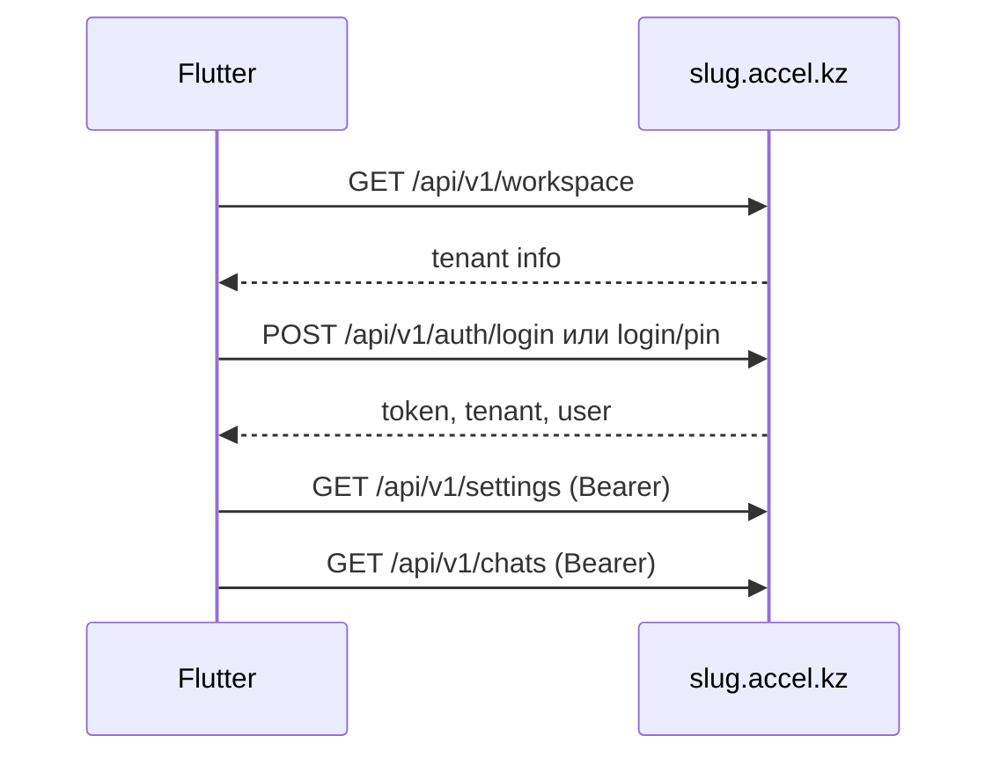

# Accel — функции по ролям и Mobile API для Flutter

Полный справочник **тенантского CRM** Accel: что доступно каждой роли, какие операции есть в Mobile API v1 (`/api/v1/*`), что остаётся только в веб-интерфейсе.

**Связанные документы:**

- [Быстрый старт API](README.md)
- [PIN-вход](PIN.md)
- [Инструкция для Flutter-агента](../mobile-app/AGENT.md)
- OpenAPI: `https://{slug}.accel.kz/docs/api/openapi.yaml` (HTTP Basic Auth)
- Исходник маршрутов: [`routes/api-tenant.php`](../../routes/api-tenant.php)

---

## Содержание

1. [Интеграция Flutter](#1-интеграция-flutter)
2. [Роли и матрица доступа](#2-роли-и-матрица-доступа)
3. [Модули тенанта](#3-модули-тенанта)
4. [Функции по разделам](#4-функции-по-разделам)
   - [4.1 Workspace и аутентификация](#41-workspace-и-аутентификация)
   - [4.2 WhatsApp-чаты](#42-whatsapp-чаты-ядро)
   - [4.3 Сообщения и медиа](#43-сообщения-и-медиа)
   - [4.4 Назначение чатов](#44-назначение-чатов)
   - [4.5 Контакты и CRM](#45-контакты-и-crm)
   - [4.6 AI](#46-ai)
   - [4.7 Воронки продаж](#47-воронки-продаж)
   - [4.8 Рассылки](#48-рассылки)
   - [4.9 Календарь](#49-календарь)
   - [4.10 Аналитика](#410-аналитика)
   - [4.11 Организация](#411-организация)
   - [4.12 Сообщества](#412-сообщества)
   - [4.13 Настройки и WhatsApp](#413-настройки-и-whatsapp)
   - [4.14 Отделы](#414-отделы)
5. [Справочник Mobile API v1](#5-справочник-mobile-api-v1)
6. [Детальные примеры API](#6-детальные-примеры-api)
7. [Realtime (Reverb)](#7-realtime-reverb)
8. [Чеклист Flutter по ролям](#8-чеклист-flutter-по-ролям)
9. [Пробелы API (только веб)](#9-пробелы-api-только-веб)

---

## 1. Интеграция Flutter

### Базовый URL

```
https://{slug}.accel.kz/api/v1/...
```

`slug` — поддомен рабочего пространства (компании). Пользователь вводит его до логина.

### Порядок первого запуска



### Заголовки

| Заголовок | Значение |
|-----------|----------|
| `Authorization` | `Bearer {token}` — после логина |
| `Accept` | `application/json` |
| `Content-Type` | `application/json` (для POST/PATCH/PUT) |

Для загрузки файлов (`multipart/form-data`) — без JSON Content-Type на теле.

### Аутентификация

- **Laravel Sanctum** Personal Access Token
- Токен выдаётся на `POST /auth/login` или `POST /auth/login/pin`
- Отзыв: `POST /auth/logout` (текущий токен)
- Деактивированный пользователь: 403 на login и на любой запрос с токеном
- Приостановленный тенант (`subscription_status: suspended|canceled`): 403 на все API

### Модули

После логина вызовите `GET /api/v1/settings` — поле `modules` содержит `on`/`off` для каждого `module_*`. Скрывайте разделы UI, если модуль выключен (см. [раздел 3](#3-модули-тенанта)).

### Коды ошибок

| HTTP | Значение |
|------|----------|
| 401 | Нет или недействительный токен |
| 403 | Нет роли, модуль выключен, policy, деактивирован user/tenant |
| 404 | Ресурс не найден |
| 422 | Ошибка валидации (`errors`) |
| 429 | Rate limit |

---

## 2. Роли и матрица доступа

Роли задаются **Spatie Permission** (guard `web`): `administrator`, `manager`, `employee`.

| Роль | Разделы UI (NavSectionAccess) | Область данных | Особые права |
|------|------------------------------|----------------|--------------|
| **administrator** | Все + Настройки | Весь тенант | CRUD воронок (структура), управление WhatsApp, пользователи, Horizon |
| **manager** | Чаты, клиенты, рассылки, AI, аналитика, календарь, воронки, организация | Отдел + назначения коллег | Назначение чатов, рассылки, pin team room |
| **employee** | То же, **без** рассылок и настроек | Свои чаты + нераспределённый пул отдела | Не назначает чаты другим |

### Политики (доступ к конкретному чату/контакту)

**ChatPolicy** (`view`):

- `administrator` — все чаты
- `manager` — чат в его отделе ИЛИ назначен коллеге из отдела
- `employee` — назначен на него ИЛИ чат в отделе без назначения

**ChatPolicy** (`assign`, `syncDepartments`): administrator, manager (если `view`).

**ChatPolicy** (`manageAi`): administrator — все; manager/employee — только если назначены на чат.

**ContactPolicy**: доступ через связанные видимые чаты.

**WhatsappSessionPolicy**: `use` — administrator или назначенная сессия; `manage` — только administrator.

**TeamConversationPolicy**: участник комнаты; administrator видит все department rooms.

---

## 3. Модули тенанта

Ключи из `GET /api/v1/settings` → `modules`:

| Ключ | UI | Nav key |
|------|-----|---------|
| `module_clients` | Клиенты | `clients` |
| `module_broadcasts` | Рассылки | `broadcasts` |
| `module_ai_chat` | AI-чат | `ai_chat` |
| `module_tasks` | Задачи и отделы | `organization` |
| `module_calendar` | Календарь | `calendar` |
| `module_analytics` | Аналитика диалогов | `analytics` |
| `module_funnels` | Воронки | `funnels` |
| `module_products` | Товары (база знаний) | settings |
| `module_services` | Услуги | settings |
| `module_knowledge` | База знаний | settings |
| `module_ai_quality` | AI и качество | settings |

**Чаты** доступны всегда (модуль не требуется). Остальные разделы — при `on` и подходящей роли.

---

## 4. Функции по разделам

Формат: **Доступ** = `Mobile API` | `Только веб` | `Mobile API` + `Только веб`.

---

### 4.1 Workspace и аутентификация

#### Проверка рабочего пространства (slug)

- **Описание:** Проверить, что slug существует и тенант активен, до экрана логина.
- **Роли:** публично
- **Модуль:** —
- **Доступ:** Mobile API
- **API:** `GET /api/v1/workspace`
- **Ответ:** `{ "data": { "id", "slug", "name", "is_active", "subscription_status" } }`
- **Flutter:** сохранить `slug`, `baseUrl`, `tenant.id`

#### Вход email/password

- **Роли:** публично
- **Доступ:** Mobile API
- **API:** `POST /api/v1/auth/login` — body: `{ "email", "password" }`
- **Ответ:** `{ "token", "token_type": "Bearer", "tenant", "user" }`
- **Ошибки:** 422 (неверные данные), 403 (деактивирован), 429 (5 попыток/email+IP)
- **Flutter:** `flutter_secure_storage` для token

#### Вход по PIN

- **Роли:** публично
- **Доступ:** Mobile API — см. [PIN.md](PIN.md)
- **API:** `POST /api/v1/auth/login/pin` — body: `{ "pin": "4829" }` (4–6 цифр)

#### Текущий пользователь / выход

- **Роли:** administrator, manager, employee
- **Доступ:** Mobile API
- **API:** `GET /api/v1/auth/me`, `POST /api/v1/auth/logout`

#### Сброс пароля, верификация email, профиль

- **Роли:** все авторизованные (веб)
- **Доступ:** Только веб — `routes/auth.php`, `GET/PATCH /profile`
- **Flutter:** не реализовано в API v1

#### Impersonation (вход от super-admin)

- **Доступ:** Только веб — `GET /impersonate/accept` (signed URL)

---

### 4.2 WhatsApp-чаты (ядро)

#### Список чатов

- **Описание:** Inbox с поиском, пагинация.
- **Роли:** все staff; видимость по ChatPolicy
- **Модуль:** всегда
- **Доступ:** Mobile API
- **API:** `GET /api/v1/chats?search=&per_page=50` (max 100)
- **Ответ:** Laravel pagination + `ChatResource`
- **Flutter:** подписка на `private-t.{companyId}.chats.list.{userId}`

#### Архив чатов

- **API:** `GET /api/v1/chats/archived`

#### Карточка чата

- **API:** `GET /api/v1/chats/{chat}` — contact, session, assignments, departments, pinned_message

#### История сообщений

- **API:** `GET /api/v1/chats/{chat}/messages?limit=50&before_timestamp=&before_id=`
- **Ответ:** `{ "messages": [ MessageResource ] }` (хронологический порядок)
- **Flutter:** подгрузка вверх по `before_timestamp` + `before_id`

#### Отправка текста

- **API:** `POST /api/v1/chats/{chat}/messages`
- **Body:** `message` (required), `display_message`, `quoted_message_id`, `mentions`, `mentions_meta`
- **Policy:** `sendMessage` на чат
- **Flutter:** после ответа — слушать `.message.received` для ack/status

#### Прочитано / typing

- **API:** `POST /api/v1/chats/{chat}/read`, `POST /api/v1/chats/{chat}/typing`

#### Pin / archive / mute / favorite / unread / clear

- **API:** `POST .../pin`, `.../archive`, `.../mute`, `.../favorite`, `.../unread`, `.../clear`

#### Закрепление сообщения в чате

- **API:** `POST /api/v1/chats/{chat}/pin-message`, `DELETE .../pin-message`

#### Загрузка файла

- **API:** `POST /api/v1/chats/{chat}/upload` — `multipart/form-data`, throttle `chat-send`
- **Веб-дубль:** `POST /chats/{chat}/upload-file`

#### Отложенные сообщения

- **API:** CRUD `GET|POST /chats/{chat}/scheduled-messages`, `PUT|DELETE .../{scheduledMessage}`

#### AI-ассистент в окне чата

- **Модуль:** косвенно AI
- **API:** `POST /api/v1/chats/{chat}/ai/chat` — throttle 30/min; policy `manageAi`
- **Веб:** `PATCH /chats/{chat}/ai` — режим auto/manual (**только веб**)

#### Начать новый диалог / создать группу / синхронизация групп

- **Доступ:** Только веб — `POST /chats/start`, `/chats/create-group`, `/chats/sync-groups`

#### Лента чатов (feed), timeline, участники группы

- **Доступ:** Только веб — `/chats/feed`, `/api/chats/{chat}/timeline`, `/chats/{chat}/participants`

#### Каталог товаров в чате, медиа/ссылки/документы

- **Доступ:** Только веб — `/chats/{chat}/products`, `/chats/{chat}/media-links-documents`

#### Быстрая задача, запрос внимания менеджера, сохранить контакт

- **Доступ:** Только веб

#### Синхронизация отделов чата

- **Доступ:** Только веб — `POST /chats/{chat}/departments` (policy `syncDepartments`)

#### AI simulate, orchestrator approve, follow-up proposals

- **Доступ:** Только веб

---

### 4.3 Сообщения и медиа

#### Реакция на сообщение

- **API:** `POST /api/v1/messages/{message}/react` — `{ "emoji": "👍" }`

#### Переслать сообщение

- **API:** `POST /api/v1/messages/{message}/forward` — `contact_ids[]`, `whatsapp_session_id`

#### Перевод сообщения

- **API:** `POST /api/v1/messages/{message}/translate` — throttle 30/min

#### Удалить / повторить отправку

- **API:** `DELETE /api/v1/messages/{message}`, `POST .../retry`

#### Скачать медиа

- **API:** `GET /api/v1/media/{media}` — Bearer, бинарный ответ

#### Массовая пересылка, share to team, AI feedback, draft translate

- **Доступ:** Только веб — `/messages/forward-bulk`, `/messages/{id}/share-to-team`, `/messages/{id}/ai-feedback`, `/chats/{chat}/translate-draft`

#### Отправить контакт / опрос

- **Доступ:** Только веб — `/chats/{chat}/send-contact`, `/send-poll`

---

### 4.4 Назначение чатов

#### Назначить сотрудника

- **Роли:** administrator, manager (policy `assign`)
- **API:** `POST /api/v1/chats/{chat}/assign` — `{ "user_id": 5 }`

#### Синхронизировать назначения

- **API:** `POST /api/v1/chats/{chat}/assign/sync` — массив user_ids

#### История / снять назначение

- **API:** `GET .../assign/history`, `DELETE .../assign/{assignment}`

---

### 4.5 Контакты и CRM

#### Список контактов

- **Модуль:** `module_clients`
- **API:** `GET /api/v1/contacts`

#### Picker контактов (для пересылки)

- **API:** `GET /api/v1/contacts/picker`

#### Карточка / профиль / AI summary

- **API:** `GET /api/v1/contacts/{contact}/card`, `/profile`, `/summary`

#### Обновить контакт / поля / upsert

- **API:** `PATCH /api/v1/contacts/{contact}`, `PATCH .../fields`, `POST /api/v1/contacts/upsert`

#### Раздел «Клиенты» (Inertia)

- **Доступ:** Только веб — `/clients`, `/clients/{contact}/profile`

#### Компании B2B, определения полей CRM

- **Доступ:** Только веб — `/settings/clients`, `/settings/companies`, `/settings/contact-fields`

#### Загрузка файла в кастомное поле

- **Доступ:** Только веб — `POST /contacts/{contact}/fields/{fieldDefinition}/upload`

---

### 4.6 AI

#### AI workspace (чат с ассистентом компании)

- **Модуль:** `module_ai_chat`
- **Роли:** все staff
- **API:** `POST /api/v1/ai-chat/query` — `{ "message", "history": [{role, content}] }`, throttle 30/min
- **API:** `GET /api/v1/ai-chat/clients/{contact}/summary`

#### AI в диалоге WhatsApp

- **API:** `POST /api/v1/chats/{chat}/ai/chat`

#### Перевод входящего сообщения

- **API:** `POST /api/v1/messages/{message}/translate`

#### База знаний, товары, услуги, правила, tone profile, AI quality, promotions

- **Доступ:** Только веб — `/settings/knowledge/*`, `/settings/tone-profile`, `/settings/ai-quality`, `/settings/promotions`

#### Entity memory (заметки по сущностям)

- **Доступ:** Только веб — `/entity-memory/{subjectType}/{subjectId}`

---

### 4.7 Воронки продаж

#### Доска воронок (kanban)

- **Модуль:** `module_funnels`
- **Роли:** все staff (просмотр/перемещение по scope)
- **API:** `GET /api/v1/funnels/board/data`, `/board/stage-cards`, `/board/card/{chat}`, `POST /board/bulk-move`

#### Стадия чата в воронке

- **API:** `PATCH /api/v1/chats/{chat}/funnel`, `GET .../funnel/history`

#### CRUD воронок и этапов

- **Роли:** **только administrator**
- **API:** `POST|PUT|DELETE /api/v1/funnels`, stages, `ai-scenario`, `ai-rule`, `ai-suggest`, `ai-onboarding-suggest`

#### Аналитика воронок

- **API:** `GET /api/v1/analytics/funnels`

#### Шаблоны воронок, страница настроек

- **Доступ:** Только веб — `/settings/funnels`, `/funnels/from-template`

---

### 4.8 Рассылки

#### Создание и превью кампании

- **Модуль:** `module_broadcasts`
- **Роли:** administrator, manager (**не** employee)
- **API:** `POST /api/v1/broadcasts/preview`, `POST /api/v1/broadcasts` (throttle 10/min)
- **Body:** `source` (excel|filters), `whatsapp_session_id`, `sender_user_id`, `file`, `filters`, `filter_message`

#### Статус кампании

- **API:** `GET /api/v1/broadcasts/{campaign}`

#### Список кампаний (UI)

- **Доступ:** Только веб — `GET /broadcasts`

---

### 4.9 Календарь

#### События в диапазоне дат

- **Модуль:** `module_calendar`
- **API:** `GET /api/v1/calendar/events?start=&end=&filter=all|mine|assigned_to_me`

#### CRUD события

- **API:** `POST /api/v1/calendar/events`, `PUT /calendar/events/{event}`, `DELETE ...`

#### Страница календаря

- **Доступ:** Только веб — `GET /calendar`

---

### 4.10 Аналитика

#### Аналитика диалогов

- **Модуль:** `module_analytics` или `module_funnels` (any)
- **API:** `GET /api/v1/analytics/dialogs` — query: `from`, `to` (required dates), `employee_id`, `department_id`, `whatsapp_session_id` (опционально)
- **Scope:** employee — только свои; manager — отдел; administrator — все

#### Аналитика воронок

- **API:** `GET /api/v1/analytics/funnels`

#### Inertia-страницы

- **Доступ:** Только веб — `/analytics/dialogs`

---

### 4.11 Организация

#### Внутренний team chat

- **Модуль:** `module_tasks`
- **Доступ:** Mobile API — префикс `/api/v1/team-chat/`
- **Основное:** `GET /conversations`, `GET /contacts`, `GET /search`, `POST /direct`
- **Комната:** messages, read, delivered, typing, react, pin, pinned-message, participants, read-meta
- **Share в WhatsApp:** `POST /team-chat/messages/{team_message}/share-to-clients`
- **Flutter:** каналы `private-t.{companyId}.team-conversation.{id}`, `team-inbox.{userId}`

#### Задачи отделов (посты, комментарии, вложения, архив)

- **Доступ:** Только веб — `/organization`, `/organization/departments/{department}/posts`, `/organization/posts/*`, `/organization/archive`

---

### 4.12 Сообщества

#### CRUD сообществ WhatsApp-групп

- **Роли:** все staff
- **API:** `GET|POST /api/v1/communities`, `GET|PUT|DELETE /communities/{community}`
- **Связь групп:** `GET .../available-groups`, `POST .../link-group`, `DELETE .../groups/{chat}`

---

### 4.13 Настройки и WhatsApp

#### Системные настройки и флаги модулей

- **API:** `GET /api/v1/settings` — `{ "settings": {...}, "modules": {...} }`

#### Статус WhatsApp-сессий (bootstrap)

- **API:** `GET /api/v1/whatsapp/sessions` — список сессий для UI (не QR)

#### Подключение WhatsApp (QR, init, logout)

- **Роли:** administrator
- **Доступ:** Только веб — `/settings/connections/*`

#### Пользователи, PIN, onboarding, модули, system

- **Доступ:** Только веб — `/settings/users`, `/settings/onboarding`, `/settings/system`

---

### 4.14 Отделы

#### Список отделов (read-only)

- **API:** `GET /api/v1/departments`

#### CRUD отделов и состав

- **Доступ:** Только веб — `/settings/departments`

---

## 5. Справочник Mobile API v1

Полный список (**98** маршрутов). Host: `https://{slug}.accel.kz`.

| Method | URI | Роли (middleware) | Throttle | Controller |
|--------|-----|-------------------|----------|------------|
| GET | `/api/v1/ai-chat/clients/{contact}/summary` | administrator, manager, employee | 30,1 | `AiWorkspaceController@clientSummary` |
| POST | `/api/v1/ai-chat/query` | administrator, manager, employee | 30,1 | `AiWorkspaceController@query` |
| GET | `/api/v1/analytics/dialogs` | administrator, manager, employee | — | `App\Http\Controllers\Api\DialogAnalyticsController` |
| GET | `/api/v1/analytics/funnels` | administrator, manager, employee | — | `App\Http\Controllers\Api\FunnelAnalyticsController` |
| POST | `/api/v1/auth/login` | public | — | `AuthController@login` |
| POST | `/api/v1/auth/login/pin` | public | — | `AuthController@loginPin` |
| POST | `/api/v1/auth/logout` | administrator, manager, employee | — | `AuthController@logout` |
| GET | `/api/v1/auth/me` | administrator, manager, employee | — | `AuthController@me` |
| POST | `/api/v1/broadcasts` | administrator, manager | 10,1 | `BroadcastController@store` |
| POST | `/api/v1/broadcasts/preview` | administrator, manager | — | `BroadcastController@preview` |
| GET | `/api/v1/broadcasts/{campaign}` | administrator, manager | — | `BroadcastController@show` |
| GET | `/api/v1/calendar/events` | administrator, manager, employee | — | `CalendarController@events` |
| POST | `/api/v1/calendar/events` | administrator, manager, employee | — | `CalendarController@store` |
| PUT | `/api/v1/calendar/events/{event}` | administrator, manager, employee | — | `CalendarController@update` |
| DELETE | `/api/v1/calendar/events/{event}` | administrator, manager, employee | — | `CalendarController@destroy` |
| GET | `/api/v1/chats` | administrator, manager, employee | — | `ChatController@index` |
| GET | `/api/v1/chats/archived` | administrator, manager, employee | — | `ChatController@archivedIndex` |
| GET | `/api/v1/chats/{chat}` | administrator, manager, employee | — | `ChatController@show` |
| POST | `/api/v1/chats/{chat}/ai/chat` | administrator, manager, employee | 30,1 | `ChatAiAssistantController@chat` |
| POST | `/api/v1/chats/{chat}/archive` | administrator, manager, employee | — | `ChatController@archive` |
| POST | `/api/v1/chats/{chat}/assign` | administrator, manager, employee | — | `ChatAssignmentController@store` |
| GET | `/api/v1/chats/{chat}/assign/history` | administrator, manager, employee | — | `ChatAssignmentController@history` |
| POST | `/api/v1/chats/{chat}/assign/sync` | administrator, manager, employee | — | `ChatAssignmentController@sync` |
| DELETE | `/api/v1/chats/{chat}/assign/{assignment}` | administrator, manager, employee | — | `ChatAssignmentController@destroy` |
| POST | `/api/v1/chats/{chat}/clear` | administrator, manager, employee | — | `ChatController@clear` |
| POST | `/api/v1/chats/{chat}/favorite` | administrator, manager, employee | — | `ChatController@toggleFavorite` |
| PATCH | `/api/v1/chats/{chat}/funnel` | administrator, manager, employee | — | `ChatFunnelController@update` |
| GET | `/api/v1/chats/{chat}/funnel/history` | administrator, manager, employee | — | `ChatFunnelController@history` |
| GET | `/api/v1/chats/{chat}/messages` | administrator, manager, employee | — | `ChatController@messages` |
| POST | `/api/v1/chats/{chat}/messages` | administrator, manager, employee | — | `ChatController@storeMessage` |
| POST | `/api/v1/chats/{chat}/mute` | administrator, manager, employee | — | `ChatController@toggleMute` |
| POST | `/api/v1/chats/{chat}/pin` | administrator, manager, employee | — | `ChatController@togglePin` |
| POST | `/api/v1/chats/{chat}/pin-message` | administrator, manager, employee | — | `ChatController@pinMessage` |
| DELETE | `/api/v1/chats/{chat}/pin-message` | administrator, manager, employee | — | `ChatController@unpinMessage` |
| POST | `/api/v1/chats/{chat}/read` | administrator, manager, employee | — | `ChatController@markRead` |
| GET | `/api/v1/chats/{chat}/scheduled-messages` | administrator, manager, employee | — | `ScheduledMessageController@index` |
| POST | `/api/v1/chats/{chat}/scheduled-messages` | administrator, manager, employee | — | `ScheduledMessageController@store` |
| PUT | `/api/v1/chats/{chat}/scheduled-messages/{scheduledMessage}` | administrator, manager, employee | — | `ScheduledMessageController@update` |
| DELETE | `/api/v1/chats/{chat}/scheduled-messages/{scheduledMessage}` | administrator, manager, employee | — | `ScheduledMessageController@destroy` |
| POST | `/api/v1/chats/{chat}/typing` | administrator, manager, employee | — | `ChatController@typing` |
| POST | `/api/v1/chats/{chat}/unread` | administrator, manager, employee | — | `ChatController@toggleUnread` |
| POST | `/api/v1/chats/{chat}/upload` | administrator, manager, employee | chat-send | `ChatController@uploadFile` |
| GET | `/api/v1/communities` | administrator, manager, employee | — | `CommunityController@index` |
| POST | `/api/v1/communities` | administrator, manager, employee | — | `CommunityController@store` |
| GET | `/api/v1/communities/{community}` | administrator, manager, employee | — | `CommunityController@show` |
| PUT | `/api/v1/communities/{community}` | administrator, manager, employee | — | `CommunityController@update` |
| DELETE | `/api/v1/communities/{community}` | administrator, manager, employee | — | `CommunityController@destroy` |
| GET | `/api/v1/communities/{community}/available-groups` | administrator, manager, employee | — | `CommunityController@availableGroups` |
| DELETE | `/api/v1/communities/{community}/groups/{chat}` | administrator, manager, employee | — | `CommunityController@unlinkGroup` |
| POST | `/api/v1/communities/{community}/link-group` | administrator, manager, employee | — | `CommunityController@linkGroup` |
| GET | `/api/v1/contacts` | administrator, manager, employee | — | `ContactController@index` |
| GET | `/api/v1/contacts/picker` | administrator, manager, employee | — | `ChatController@contacts` |
| POST | `/api/v1/contacts/upsert` | administrator, manager, employee | — | `ContactController@upsert` |
| PATCH | `/api/v1/contacts/{contact}` | administrator, manager, employee | — | `ContactController@update` |
| GET | `/api/v1/contacts/{contact}/card` | administrator, manager, employee | — | `ContactController@card` |
| PATCH | `/api/v1/contacts/{contact}/fields` | administrator, manager, employee | — | `ContactController@updateFields` |
| GET | `/api/v1/contacts/{contact}/profile` | administrator, manager, employee | — | `ContactController@clientProfile` |
| GET | `/api/v1/contacts/{contact}/summary` | administrator, manager, employee | — | `ContactController@clientSummary` |
| GET | `/api/v1/departments` | administrator, manager, employee | — | `DepartmentController@index` |
| POST | `/api/v1/funnels` | administrator | — | `FunnelController@store` |
| POST | `/api/v1/funnels/ai-onboarding-suggest` | administrator | — | `FunnelController@aiOnboardingSuggest` |
| POST | `/api/v1/funnels/ai-suggest` | administrator | — | `FunnelController@aiSuggest` |
| POST | `/api/v1/funnels/board/bulk-move` | administrator, manager, employee | — | `FunnelBoardController@bulkMove` |
| GET | `/api/v1/funnels/board/card/{chat}` | administrator, manager, employee | — | `FunnelBoardController@card` |
| GET | `/api/v1/funnels/board/data` | administrator, manager, employee | — | `FunnelBoardController@data` |
| GET | `/api/v1/funnels/board/stage-cards` | administrator, manager, employee | — | `FunnelBoardController@stageCards` |
| PUT | `/api/v1/funnels/{funnel}` | administrator | — | `FunnelController@update` |
| DELETE | `/api/v1/funnels/{funnel}` | administrator | — | `FunnelController@destroy` |
| PATCH | `/api/v1/funnels/{funnel}/ai-scenario` | administrator | — | `FunnelController@updateAiScenario` |
| POST | `/api/v1/funnels/{funnel}/stages` | administrator | — | `FunnelController@storeStage` |
| POST | `/api/v1/funnels/{funnel}/stages/reorder` | administrator | — | `FunnelController@reorderStages` |
| PUT | `/api/v1/funnels/{funnel}/stages/{stage}` | administrator | — | `FunnelController@updateStage` |
| DELETE | `/api/v1/funnels/{funnel}/stages/{stage}` | administrator | — | `FunnelController@destroyStage` |
| PATCH | `/api/v1/funnels/{funnel}/stages/{stage}/ai-rule` | administrator | — | `FunnelController@updateStageAiRule` |
| GET | `/api/v1/media/{media}` | administrator, manager, employee | — | `MediaController@show` |
| DELETE | `/api/v1/messages/{message}` | administrator, manager, employee | — | `MessageController@destroy` |
| POST | `/api/v1/messages/{message}/forward` | administrator, manager, employee | — | `MessageController@forward` |
| POST | `/api/v1/messages/{message}/react` | administrator, manager, employee | — | `MessageController@react` |
| POST | `/api/v1/messages/{message}/retry` | administrator, manager, employee | — | `MessageController@retry` |
| POST | `/api/v1/messages/{message}/translate` | administrator, manager, employee | 30,1 | `MessageTranslationController@translate` |
| GET | `/api/v1/settings` | administrator, manager, employee | — | `SettingsController@show` |
| GET | `/api/v1/team-chat/contacts` | administrator, manager, employee | — | `OrganizationTeamChatController@contacts` |
| GET | `/api/v1/team-chat/conversations` | administrator, manager, employee | — | `OrganizationTeamChatController@conversations` |
| POST | `/api/v1/team-chat/direct` | administrator, manager, employee | — | `OrganizationTeamChatController@openDirect` |
| POST | `/api/v1/team-chat/messages/{team_message}/share-to-clients` | administrator, manager, employee | — | `OrganizationTeamChatController@shareToClients` |
| GET | `/api/v1/team-chat/search` | administrator, manager, employee | — | `OrganizationTeamChatController@search` |
| POST | `/api/v1/team-chat/{team_conversation}/delivered` | administrator, manager, employee | — | `OrganizationTeamChatController@markDelivered` |
| GET | `/api/v1/team-chat/{team_conversation}/messages` | administrator, manager, employee | — | `OrganizationTeamChatController@messages` |
| POST | `/api/v1/team-chat/{team_conversation}/messages` | administrator, manager, employee | — | `OrganizationTeamChatController@storeMessage` |
| POST | `/api/v1/team-chat/{team_conversation}/messages/{team_message}/react` | administrator, manager, employee | — | `OrganizationTeamChatController@reactToMessage` |
| GET | `/api/v1/team-chat/{team_conversation}/participants` | administrator, manager, employee | — | `OrganizationTeamChatController@participants` |
| POST | `/api/v1/team-chat/{team_conversation}/pin` | administrator, manager, employee | — | `OrganizationTeamChatController@setPinned` |
| POST | `/api/v1/team-chat/{team_conversation}/pinned-message` | administrator, manager, employee | — | `OrganizationTeamChatController@setRoomPinnedMessage` |
| POST | `/api/v1/team-chat/{team_conversation}/read` | administrator, manager, employee | — | `OrganizationTeamChatController@markRead` |
| GET | `/api/v1/team-chat/{team_conversation}/read-meta` | administrator, manager, employee | — | `OrganizationTeamChatController@readMeta` |
| POST | `/api/v1/team-chat/{team_conversation}/typing` | administrator, manager, employee | — | `OrganizationTeamChatController@typing` |
| GET | `/api/v1/whatsapp/sessions` | administrator, manager, employee | — | `WhatsappSessionController@bootstrap` |
| GET | `/api/v1/workspace` | public | — | `WorkspaceController@show` |

> **Примечание к таблице:** маршруты `broadcasts/*` дополнительно требуют роли `administrator` или `manager` (вложенный middleware). Маршруты `POST/PUT/DELETE /funnels` (кроме `board/*`) — только `administrator`.


---

## 6. Детальные примеры API

Подставьте `SLUG=demo`, `TOKEN=...`.

### Workspace

```bash
curl -s "https://demo.accel.kz/api/v1/workspace" -H "Accept: application/json"
```

### Login

```bash
curl -s -X POST "https://demo.accel.kz/api/v1/auth/login" \
  -H "Content-Type: application/json" -H "Accept: application/json" \
  -d '{"email":"user@example.com","password":"secret"}'
```

Ответ:

```json
{
  "token": "1|…",
  "token_type": "Bearer",
  "tenant": { "id": 1, "slug": "demo", "name": "…", "is_active": true, "subscription_status": "active" },
  "user": { "id": 1, "name": "…", "email": "…", "roles": ["employee"], "department_id": 1, "is_active": true }
}
```

### Settings (модули)

```bash
curl -s "https://demo.accel.kz/api/v1/settings" \
  -H "Authorization: Bearer $TOKEN" -H "Accept: application/json"
```

### Список чатов

```bash
curl -s "https://demo.accel.kz/api/v1/chats?per_page=20" \
  -H "Authorization: Bearer $TOKEN" -H "Accept: application/json"
```

### Сообщения

```bash
curl -s "https://demo.accel.kz/api/v1/chats/42/messages?limit=30" \
  -H "Authorization: Bearer $TOKEN"
```

### Отправка текста

```bash
curl -s -X POST "https://demo.accel.kz/api/v1/chats/42/messages" \
  -H "Authorization: Bearer $TOKEN" -H "Content-Type: application/json" \
  -d '{"message":"Привет из Flutter"}'
```

### Медиа

URL в `MessageResource.media[].url` указывает на `/api/v1/media/{id}` — запрашивать с тем же Bearer.

---

## 7. Realtime (Reverb)

### Авторизация канала

```bash
curl -s -X POST "https://demo.accel.kz/broadcasting/auth" \
  -H "Authorization: Bearer $TOKEN" \
  -H "Content-Type: application/json" \
  -d '{"channel_name":"private-t.1.chat.42","socket_id":"123.456"}'
```

### Каналы (private)

| Канал | События | Назначение |
|-------|---------|------------|
| `private-t.{companyId}.chat.{chatId}` | `.message.received`, `.user.typing`, `.message.reactions`, `.message.ack` | Открытый WhatsApp-чат |
| `private-t.{companyId}.chats.list.{userId}` | обновление списка | Inbox |
| `private-t.{companyId}.team-conversation.{id}` | `.team.message`, `.team.typing`, … | Team chat |
| `private-t.{companyId}.team-inbox.{userId}` | inbox team | Список командных диалогов |
| `private-t.{companyId}.whatsapp-status` | статус сессий | administrator, manager |
| `private-t.{companyId}.funnel-board.{funnelId}` | карточки доски | module_funnels |

### Flutter

- Пакет: `pusher_channels_flutter`
- Env: `REVERB_APP_KEY`, `REVERB_HOST`, `REVERB_PORT`, `REVERB_SCHEME`
- После login сохранить `tenant.id` как `companyId`, `user.id` для list/inbox каналов

---

## 8. Чеклист Flutter по ролям

### Общее для всех ролей

- [ ] Экран ввода slug → `GET /workspace`
- [ ] Login (email или PIN) → сохранить token
- [ ] `GET /settings` → спрятать выключенные модули
- [ ] Reverb + `/broadcasting/auth`
- [ ] Inbox чатов + realtime
- [ ] Экран чата: messages, send, read, typing, media

### employee

- [ ] Чаты (только видимые по policy)
- [ ] Контакты (`module_clients`)
- [ ] AI workspace + AI в чате (`module_ai_chat`)
- [ ] Календарь (`module_calendar`)
- [ ] Воронки board (`module_funnels`) — без admin CRUD
- [ ] Аналитика — только свои данные
- [ ] Team chat (`module_tasks`)
- [ ] **Нет** рассылок

### manager

- [ ] Всё как employee +
- [ ] Назначение чатов (`assign`, `assign/sync`)
- [ ] Рассылки (`module_broadcasts`)
- [ ] Аналитика по отделу
- [ ] WhatsApp status channel (опционально)

### administrator

- [ ] Всё как manager +
- [ ] CRUD воронок через API (если нужен mobile admin)
- [ ] Просмотр всех чатов/аналитики
- [ ] **Настройки** (QR, users, knowledge) — пока только веб или WebView

---

## 9. Пробелы API (только веб)

Функции, которые **ожидают в мобилке**, но **не имеют** `/api/v1`:

| Функция | Веб-маршрут | Рекомендация для Flutter |
|---------|-------------|---------------------------|
| Задачи отделов | `/organization/.../posts` | Ждать API или WebView |
| Управление пользователями / PIN | `/settings/users` | Только веб CRM |
| Подключение WhatsApp QR | `/settings/connections/{session}/qr` | Только веб |
| База знаний, товары, услуги | `/settings/knowledge/*` | Только веб |
| Entity memory | `/entity-memory/*` | Только веб |
| Новый чат / создание группы | `/chats/start`, `/create-group` | Только веб |
| Режим AI чата (auto/manual) | `PATCH /chats/{chat}/ai` | Только веб |
| Сброс пароля | `routes/auth.php` | Deep link в браузер |
| Компании клиентов, поля CRM | `/settings/companies`, `/contact-fields` | Только веб |
| Массовая пересылка | `/messages/forward-bulk` | Только веб |

При необходимости новых endpoint — ориентир: дублировать логику из [`routes/tenant.php`](../../routes/tenant.php) в [`routes/api-tenant.php`](../../routes/api-tenant.php) с `auth:sanctum`.

---

*Документ сгенерирован по состоянию кодовой базы Accel. Актуальный список маршрутов: `php artisan route:list --path=api/v1`.*
