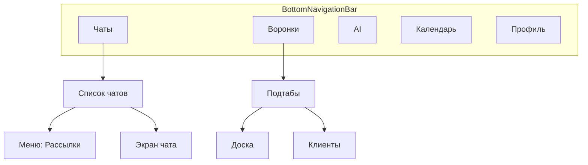

# Accel — мобильный UI для Flutter (спецификация)

Подробное описание **как реализовано в веб-CRM**, что подключать через **Mobile API v1**, и где **пробелы API**. Только документация — без правок бэкенда.

**Связанные документы:**

- [FEATURES_BY_ROLE.md](./FEATURES_BY_ROLE.md) — полный каталог функций, роли, таблица ~98 endpoints
- [README.md](./README.md) — быстрый старт API, Sanctum, Reverb
- [PIN.md](./PIN.md) — вход по PIN
- [../mobile-app/AGENT.md](../mobile-app/AGENT.md) — гайд для Cursor во Flutter-репо

---

## Содержание

1. [Назначение и отличия от веба](#1-назначение-и-отличия-от-веба)
2. [Нижний TabBar (предлагаемая IA)](#2-нижний-tabbar-предлагаемая-ia)
3. [Tab «Чаты»](#3-tab-чаты)
4. [Tab «Воронки»](#4-tab-воронки)
5. [Tab «AI-ассистент»](#5-tab-ai-ассистент)
6. [Tab «Календарь»](#6-tab-календарь)
7. [Раздел «Клиенты» — вёрстка и API](#7-раздел-клиенты--вёрстка-и-api)
8. [Сводная таблица API](#8-сводная-таблица-api)
9. [Чеклист интеграции Flutter](#9-чеклист-интеграции-flutter)
10. [Realtime](#10-realtime)

---

## 1. Назначение и отличия от веба

| Документ | Для чего |
|----------|----------|
| **FEATURES_BY_ROLE.md** | Все функции тенанта, роли, справочник `/api/v1/*` |
| **FLUTTER_MOBILE_UI.md** (этот файл) | Конкретные **экраны мобилки**, привязка к Vue-страницам, UX-решения, пробелы API |

### Веб-навигация (эталон)

Левый rail 60px: [`resources/js/Layouts/AuthenticatedLayout.vue`](../../resources/js/Layouts/AuthenticatedLayout.vue)

| Иконка rail | Маршрут | Модуль / роль |
|-------------|---------|---------------|
| Чаты | `/chats` | всегда |
| Клиенты | `/clients` | `module_clients` |
| Рассылки | `/broadcasts` | `module_broadcasts`, admin+manager |
| AI-чат | `/ai-chat` | `module_ai_chat` |
| Аналитика | `/analytics/dialogs` | `module_analytics` или `module_funnels` |
| Календарь | `/calendar` | `module_calendar` |
| Воронки | `/funnels/board` | `module_funnels` |

Видимость: `page.props.nav` из [`NavSectionAccess`](../../app/Support/NavSectionAccess.php). После логина в Flutter: `GET /api/v1/settings` → `modules`.

### Мобильная IA (ваше ТЗ) — намеренные отличия

| Элемент | Веб | Мобилка (ТЗ) |
|---------|-----|--------------|
| Рассылки | Отдельная иконка в rail | Пункт в **меню шапки списка чатов** (справа) |
| Воронки + клиенты | Два разных пункта rail | **Один tab «Воронки»**, внутри 2 подтаба: Доска / Клиенты |
| Звонки | Нет UI звонка в чате; только уведомление `call_incoming` | **Не реализовывать** |
| AI в чате | Toggle в шапке чата | То же + **нет API** (см. §3.3) |

---

## 2. Нижний TabBar (предлагаемая IA)



### Рекомендуемый состав tab bar

| Tab | Показывать если | Корневой экран |
|-----|-----------------|----------------|
| **Чаты** | всегда | Inbox `GET /api/v1/chats` |
| **Воронки** | `modules.module_funnels === on` | Подтабы Доска / Клиенты |
| **AI** | `modules.module_ai_chat === on` | Workspace query |
| **Календарь** | `modules.module_calendar === on` | Month + events |
| **Профиль** | всегда | `GET /api/v1/auth/me`, logout, slug |

**Не выносить в tab bar (v1):** Аналитика, Организация/team-chat, Настройки, отдельный tab «Клиенты» (вложен в Воронки).

**Скрывать tab**, если модуль `off` или нет роли (рассылки — только из меню чатов, не tab).

---

## 3. Tab «Чаты»

### 3.1 Список чатов (главный экран)

**Веб:** [`resources/js/Pages/Chats/`](../../resources/js/Pages/Chats/) + [`ChatSidebar.vue`](../../resources/js/Pages/Chats/Partials/ChatSidebar.vue)

**API:**

```http
GET /api/v1/chats?search=&per_page=50
GET /api/v1/chats/archived?...
Authorization: Bearer {token}
```

**Ответ:** pagination + [`ChatResource`](../../app/Http/Resources/Api/V1/ChatResource.php) (`id`, `chat_name`, `unread_count`, `last_message_*`, `contact`, `whatsapp_session`, `assignments`, …).

**Realtime:** `private-t.{companyId}.chats.list.{userId}` — обновление списка.

#### Шапка справа — overflow menu → «Рассылки»

**Веб:** рассылки — **не** в шапке чатов, а rail → [`Broadcasts/Index.vue`](../../resources/js/Pages/Broadcasts/Index.vue).

**Мобилка:** `IconButton` (три точки или иконка) → `PopupMenu`:

- «Рассылки» → `BroadcastsScreen` (только если `nav.broadcasts` логика: роль admin/manager + `module_broadcasts`)
- опционально: Архив, Настройки (позже)

**Роли:** `administrator`, `manager` — **не** `employee`.

---

### 3.2 Экран «Рассылки» (`/broadcasts`)

**Веб-поведение** ([`Broadcasts/Index.vue`](../../resources/js/Pages/Broadcasts/Index.vue)):

1. Режим: **Excel** или **Фильтры** (`UiPillNav`)
2. Выбор WhatsApp-сессии, отправитель (`sender_user_id`)
3. Preview → таблица строк (ready/skipped)
4. Старт кампании → polling статуса каждые 4 с

**Mobile API (есть):**

| Шаг | Method | Path | Content-Type |
|-----|--------|------|--------------|
| Preview | POST | `/api/v1/broadcasts/preview` | `multipart/form-data` |
| Старт | POST | `/api/v1/broadcasts` | `multipart/form-data`, throttle **10/min** |
| Статус | GET | `/api/v1/broadcasts/{campaign}` | JSON |

**Поля FormData (как на вебе):**

| Поле | Обязательно | Описание |
|------|-------------|----------|
| `source` | да | `excel` или `filters` |
| `whatsapp_session_id` | да | int |
| `sender_user_id` | да (store) | int, на вебе admin может выбрать любого, manager — себя |
| `file` | excel | `.xlsx`/`.csv`, max 10 MB |
| `filter_message` | filters | текст для фильтрации |
| `filters[search]` | нет | поиск контактов |
| `filters[company_name]` | нет | B2B компания |

**Пробел API:**

| Данные с веб `broadcasts.index` | API v1 |
|--------------------------------|--------|
| Список последних кампаний | **нет** `GET /api/v1/broadcasts` |
| `sessions[]`, `senders[]` | частично: `GET /api/v1/whatsapp/sessions` (bootstrap) |
| `rateLimit` snapshot | **нет** |

**Обход для Flutter:**

- Сессии: `GET /api/v1/whatsapp/sessions`
- Отправитель: текущий `user.id` (manager) или picker из `GET /api/v1/departments` + users (нет list users API — manager = self)
- История кампаний: сохранять `campaign.id` локально после `store` или ждать backend list endpoint

**Пример preview (filters):**

```bash
curl -s -X POST "https://demo.accel.kz/api/v1/broadcasts/preview" \
  -H "Authorization: Bearer $TOKEN" \
  -F "source=filters" \
  -F "whatsapp_session_id=1" \
  -F "filter_message=текст рассылки" \
  -F "filters[search]="
```

---

### 3.3 Экран чата — шапка

**Веб:** [`ChatHeader.vue`](../../resources/js/Pages/Chats/Partials/ChatHeader.vue), стили [`chat-header.css`](../../resources/js/Pages/Chats/Partials/chat-header.css)

**API сообщений:**

```http
GET  /api/v1/chats/{chat}/messages?limit=50&before_timestamp=&before_id=
POST /api/v1/chats/{chat}/messages  {"message": "..."}
POST /api/v1/chats/{chat}/read
POST /api/v1/chats/{chat}/typing
```

---

#### A) Тап по имени / аватару → карточка контакта

**Веб:** `openContactInfo()` → правая панель [`ContactInfoPanel.vue`](../../resources/js/Pages/Chats/Partials/ContactInfoPanel.vue):

- CRM-поля, сделка, календарь, задачи отдела (insights)
- Entity memory (только веб)
- Ссылка на полный профиль клиента

**Mobile API (достаточно для карточки):**

| Действие | API |
|----------|-----|
| Краткая CRM-карточка | `GET /api/v1/contacts/{contact}/card?chat_id={chatId}` |
| Полный профиль (секции) | `GET /api/v1/contacts/{contact}/profile?chat_id={chatId}&with_ai=1` |
| AI summary | `GET /api/v1/contacts/{contact}/summary?chat_id={chatId}` |
| Имя | `PATCH /api/v1/contacts/{contact}` body `{"name": "..."}` |
| Кастомные поля | `PATCH /api/v1/contacts/{contact}/fields` |

**Flutter UX:** `Navigator.push(ContactDetailScreen)` или `showModalBottomSheet` на весь экран; не боковая панель 400px как на десктопе.

**Нет в API:** `entity-memory/*`, sidebar `tasks`/`events` из Inertia insights — см. [FEATURES_BY_ROLE.md §9](./FEATURES_BY_ROLE.md).

**Policy:** [`ContactPolicy`](../../app/Policies/ContactPolicy.php) — view через видимые чаты.

---

#### B) Кнопка AI: вкл / выкл автоответ

**Веб:**

- Поля чата: `ai_enabled` (bool), `ai_mode` (`auto` | `draft`)
- Кнопка с зелёной точкой: `toggleAi()` → `PATCH /chats/{chat}/ai`
- При рискованном включении: модалка подтверждения (`requires_confirmation`, `warnings`, `readiness`)
- Policy: `manageAi` — admin все чаты; manager/employee только назначенные

**Контроллер:** [`ChatAiSettingsController::update`](../../app/Http/Controllers/ChatAiSettingsController.php)

**Body PATCH (веб, session):**

```json
{
  "ai_enabled": true,
  "ai_mode": "auto",
  "ai_responder_user_id": 5,
  "company_id": 1,
  "confirm_risky_enable": false
}
```

**Ответ успеха (веб):** `{ "success": true, "chat": { ... полная модель Chat ... } }`

**Mobile API:** **НЕТ** — маршрут только в [`routes/tenant.php`](../../routes/tenant.php) (`chats.ai.update`), **отсутствует** в [`routes/api-tenant.php`](../../routes/api-tenant.php).

| Статус | Действие |
|--------|----------|
| **Критический пробел** | Нужен `PATCH /api/v1/chats/{chat}/ai` с той же логикой |
| Временный обход | WebView на URL чата (сессия не подходит для Sanctum) или не показывать toggle |

**Отдельно:** in-chat AI **панель** (подсказки оператору) — `POST /api/v1/chats/{chat}/ai/chat` (есть, throttle 30/min). Это **не** toggle автоответа.

---

#### C) Шкала воронки + модалка (как на десктопе)

**Веб — полоска прогресса:**

- Внизу шапки чата: кликабельная зона `h-3`, `role="progressbar"`
- Ячейки = этапы воронки; заливка цветом `funnel.color` до текущего индекса
- Данные: `chat.funnel`, `chat.funnel_stage`, `chat.funnel_progress` (`stage_index`, `stages_count`, `percent`)
- Источник: [`ChatFunnelStateService::inertiaExtras`](../../app/Services/Funnel/ChatFunnelStateService.php)
- Под именем: компактная строка `funnelCompactLine` (этап · % · AI badge · следующий этап)

**Веб — модалка** (`openFunnelModal`):

| Поле | Описание |
|------|----------|
| `funnel_id` | выбор воронки |
| `funnel_stage_id` | wheel picker этапов |
| `funnel_tracking_enabled` | AI отслеживает стадию |
| `funnel_stage_locked` | блокировка смены AI |
| История | `GET /chats/{chat}/funnel/history` |

**Сохранение:** `PATCH /chats/{chat}/funnel` → **Mobile:** `PATCH /api/v1/chats/{chat}/funnel`

**Body PATCH funnel:**

```json
{
  "funnel_id": 2,
  "funnel_stage_id": 15,
  "funnel_tracking_enabled": true,
  "funnel_stage_locked": false
}
```

Очистка воронки: оба `funnel_id` и `funnel_stage_id` = `null` (вместе).

**Ответ API** ([`ChatFunnelController::update`](../../app/Http/Controllers/ChatFunnelController.php)):

```json
{
  "success": true,
  "chat": { "...": "..." },
  "funnel_catalog": [ { "id", "name", "color", "stages": [...] } ]
}
```

`funnel_catalog` — список воронок с этапами для picker (на вебе ещё приходит Inertia prop `funnelCatalog` при открытии чата).

**История:**

```http
GET /api/v1/chats/{chat}/funnel/history
```

Ответ: `{ "data": [ { "id", "source", "reason", "confidence", "from_*", "to_*", "created_at" } ] }`

**Пробел: начальное состояние для полоски**

`GET /api/v1/chats/{chat}` ([`ChatResource`](../../app/Http/Resources/Api/V1/ChatResource.php)) **не включает** `funnel`, `funnel_stage`, `funnel_progress`, `ai_enabled`.

**Обходы без доработки бэкенда:**

1. **Рекомендуемый:** после открытия чата вызвать `GET /api/v1/funnels/board/card/{chat}?funnel_id=X` — нужен известный `funnel_id` (из контакта `stage` / последний сохранённый / из `PATCH` ответа).
2. Запросить `GET /api/v1/chats/{chat}/funnel-state` или расширить `ChatResource` (идеально).

**Flutter — модалка (паритет):**

- Верх: сегментированная полоска этапов (как `modalFunnelSegmentStyle`)
- `Dropdown` / wheel: воронка + этап
- Switch: tracking, locked
- Список истории transitions
- Кнопка «Сохранить» → PATCH funnel → обновить локальный state + полоску

**Realtime:**

- `private-t.{companyId}.chat.{chatId}` — событие обновления воронки чата
- Доска: `private-t.{companyId}.funnel-board.{funnelId}` — если открыта доска

---

#### D) Звонки — не реализовывать

| Факт | Деталь |
|------|--------|
| UI чата | **Нет** кнопки «Позвонить» в [`ChatHeader.vue`](../../resources/js/Pages/Chats/Partials/ChatHeader.vue) |
| Backend | WhatsApp webhook `call_incoming` → [`WhatsappWebhookController`](../../app/Http/Controllers/Api/WhatsappWebhookController.php) |
| Desktop | [`useChatsListDesktopNotifications.ts`](../../resources/js/composables/useChatsListDesktopNotifications.ts) — notification `kind === call_incoming'`, скрывается если вкладка в фокусе |

**Flutter:**

- Не добавлять иконку телефона, не интегрировать VoIP
- Опционально: snackbar «Входящий звонок WhatsApp» если позже появится push/event (v2)
- Убедиться, что в макетах Flutter **нет** call action

---

## 4. Tab «Воронки»

Модуль: `module_funnels`. Роли: все staff (`administrator`, `manager`, `employee`) с разным scope данных.

**Внутренние подтабы** (паттерн [`UiPillNav`](../../resources/js/Components/Ui/UiPillNav.vue) как в [`Clients/Index.vue`](../../resources/js/Pages/Clients/Index.vue)):

| Подтаб | Веб-аналог | API |
|--------|------------|-----|
| **Доска** | `/funnels/board` | `funnels/board/*` |
| **Клиенты** | `/clients` | `contacts/*` |

---

### 4.1 Подтаб «Доска» (mobile-оптимизация `funnels/board`)

**Веб:** [`Funnels/Board.vue`](../../resources/js/Pages/Funnels/Board.vue)

**Ключевые возможности веб (не все переносить в v1):**

- Горизонтальный kanban, drag-and-drop ([`useFunnelBoardSortable`](../../resources/js/composables/useFunnelBoardSortable.ts))
- Scope pills: `all` | `mine` | `department`
- Поиск, advanced filters (assignee, department, WA session) — admin/manager
- Bulk select + bulk move
- Presence «на доске» ([`useFunnelBoardPresence`](../../resources/js/composables/useFunnelBoardPresence.ts))
- Realtime ([`useFunnelBoardRealtime`](../../resources/js/composables/useFunnelBoardRealtime.ts))
- Карточка: имя, телефон, assignees, unread, AI reason; клик → открыть чат

**Mobile API — полный набор:**

#### Загрузка доски

```http
GET /api/v1/funnels/board/data?funnel_id=1&scope=all&search=&assignee_id=&department_id=&whatsapp_session_id=
```

| Query | Тип | Описание |
|-------|-----|----------|
| `funnel_id` | required int | ID воронки |
| `scope` | `all`\|`mine`\|`department` | см. роль |
| `search` | string, max 120 | поиск по имени/телефону |
| `assignee_id` | int | admin/manager |
| `department_id` | int | admin/manager |
| `whatsapp_session_id` | int | admin/manager |

**Scope по ролям** ([`FunnelBoardFilters`](../../app/Support/FunnelBoardFilters.php)):

| Роль | `all` | `mine` | `department` |
|------|-------|--------|--------------|
| administrator | все чаты тенанта | свои назначения | свой отдел |
| manager | ограничен отделом | свои | отдел |
| employee | нет «все» | свои | отдел |

`canFilterAll` / `canUseAdvancedFilters` на вебе: admin / admin+manager.

**Структура ответа `board/data`:**

```json
{
  "funnel": { "id", "name", "color", "description" },
  "stages": [
    {
      "id": 10,
      "name": "Новый",
      "color": "#01b964",
      "stage_type": "open",
      "stage_tone": "default",
      "position": 1,
      "is_inbox": false,
      "cards": [ /* BoardCard */ ],
      "cards_total": 120,
      "has_more": true,
      "stats": { "cards_total", "entered_7d", "conversion_pct", "avg_days", "sparkline" },
      "wip_limit": null
    }
  ]
}
```

**Карточка** ([`FunnelBoardService::serializeCard`](../../app/Services/Funnel/FunnelBoardService.php)):

```json
{
  "id": 42,
  "name": "Иван",
  "phone": "+77001234567",
  "last_message_text": "...",
  "last_message_at": "2026-06-01T12:00:00+00:00",
  "unread_count": 2,
  "assignees": [{ "id": 5, "name": "Менеджер" }],
  "funnel_stage_id": 10,
  "funnel_stage_locked": false,
  "funnel_ai_reason": "Клиент спросил цену"
}
```

**Специальные этапы:**

| `stage.id` | Константа | Смысл |
|------------|-----------|-------|
| `-1` | `INBOX_STAGE_ID` | Inbox (входящие без этапа) |
| `0` | `ORPHAN_STAGE_ID` | Без этапа в воронке |

**Лимит:** `CARDS_PER_STAGE = 50` — дальше `has_more: true`.

#### Подгрузка карточек колонки

```http
GET /api/v1/funnels/board/stage-cards?funnel_id=1&stage_id=10&offset=50&scope=all
```

Ответ: `{ "cards": [ BoardCard, ... ] }`

#### Перемещение карточки

**Одна карточка:**

```http
PATCH /api/v1/chats/{chat}/funnel
Content-Type: application/json

{"funnel_id": 1, "funnel_stage_id": 12}
```

**Несколько:**

```http
POST /api/v1/funnels/board/bulk-move
{"funnel_id": 1, "stage_id": 12, "chat_ids": [42, 43], "force_locked": false}
```

#### История карточки

```http
GET /api/v1/chats/{chat}/funnel/history
```

#### Список воронок для dropdown

| Веб | API v1 |
|-----|--------|
| Inertia `funnels[]` на странице board | **Нет** `GET /api/v1/funnels` (index) для staff |
| | Admin: CRUD есть, но не list для picker |

**Обход:** сохранить `funnel_id` в `SharedPreferences`; первый раз — взять из `board/data` после выбора в настройках onboarding; или запросить backend `GET /api/v1/funnels/active`.

---

### 4.2 Mobile UX доски (рекомендации, без кода)

**Не копировать** горизонтальный kanban 1:1 — на телефоне неудобно.

| Паттерн | Описание |
|---------|----------|
| **Вариант A** | Верх: dropdown воронки + scope chips + search. Ниже: **горизонтальный PageView** по этапам, внутри — `ListView` карточек |
| **Вариант B** | Вертикальный список **этапов-аккордеонов**; внутри этапа — карточки |
| Tap карточки | `Navigator` → `ChatScreen(chatId)` |
| Long press | Bottom sheet: «Переместить на этап», «Назначить мне» (`POST /api/v1/chats/{id}/assign`) |
| Pull-to-refresh | `GET board/data` |
| v2 | Drag-and-drop между этапами |

**Не переносить в v1:** Shift+multiselect, bulk toolbar, keyboard navigation, sparkline stats (можно badge count only).

**Realtime:** подписаться на `private-t.{companyId}.funnel-board.{funnelId}` при открытом подтабе.

---

### 4.3 Подтаб «Клиенты»

См. [§7](#7-раздел-клиенты--вёрстка-и-api) — полное описание вёрстки.

Кратко API:

```http
GET /api/v1/contacts?search=иван&page=1&per_page=20&filters[funnel_stage]=12&filters[assignee]=5
```

Фильтры: объект `filters` с кодами полей (см. [`ContactListFilters`](../../app/Support/ContactListFilters.php)), на вебе определения в Inertia `filterFields`.

---

## 5. Tab «AI-ассистент»

**Веб:** [`AiChat/Index.vue`](../../resources/js/Pages/AiChat/Index.vue)

**Структура веб (desktop):**

| Колонка | Содержимое |
|---------|------------|
| Левая (~260px) | Список «тредов» (localStorage `accel:ai-workspace:threads:v3`) |
| Центр | Диалог user/assistant, textarea, suggestions |
| Правая (resizable) | Результаты: вкладки contacts / metrics / визуализации |

**Mobile API:**

```http
POST /api/v1/ai-chat/query
Content-Type: application/json

{
  "message": "Сколько сделок на этапе КП?",
  "history": [
    { "role": "user", "content": "..." },
    { "role": "assistant", "content": "..." }
  ]
}
```

Throttle: **30 req/min**.

```http
GET /api/v1/ai-chat/clients/{contact}/summary
```

**Модуль:** `module_ai_chat`. Роли: все staff.

**Flutter (упрощение):**

- Один активный тред; история тредов — **локально** (как веб), сервер не хранит threads
- Без правой панели v1: ответ assistant текстом; если в ответе есть structured data — карточки контактов inline
- Suggestions: prop `suggestions[]` с Inertia на вебе — на API **нет**; захардкодить или `GET settings`

**Не путать с:**

| Функция | API |
|---------|-----|
| AI workspace (tab) | `POST /api/v1/ai-chat/query` |
| AI в окне чата | `POST /api/v1/chats/{chat}/ai/chat` |
| AI summary клиента | `GET /api/v1/contacts/{id}/summary` или `ai-chat/clients/{id}/summary` |

---

## 6. Tab «Календарь»

**Веб:** [`Calendar/Index.vue`](../../resources/js/Pages/Calendar/Index.vue)

**Возможности веб:**

- Views: month / week (`UiPillNav`)
- List filter: `all` | `mine` | `assigned_to_me`
- События в диапазоне + модалка create/edit/delete
- Поля: title, description, color (PALETTE 11 цветов), starts_at, ends_at, all_day, recurrence (`daily`|`weekly`|`monthly`|`yearly`), recurrence_ends_at, assignee_user_id
- Связь с чатом/контактом в meta (read-only в модалке для AI-created)

**Mobile API (полный CRUD):**

```http
GET /api/v1/calendar/events?start=2026-06-01&end=2026-06-30&filter=mine&author_id=&assignee_id=
POST /api/v1/calendar/events
PUT /api/v1/calendar/events/{event}
DELETE /api/v1/calendar/events/{event}
```

**POST/PUT body** ([`CalendarController::validateEvent`](../../app/Http/Controllers/CalendarController.php)):

| Поле | Правила |
|------|---------|
| `title` | required, max 255 |
| `description` | nullable, max 5000 |
| `color` | nullable, max 16, default `#25d366` |
| `starts_at` | required, date |
| `ends_at` | required, >= starts_at |
| `all_day` | boolean |
| `recurrence` | nullable: daily, weekly, monthly, yearly |
| `recurrence_ends_at` | nullable, date |
| `assignee_user_id` | nullable, must be in assignable list for role |

**Ответ GET:** массив events (через [`CalendarEventsInRangeCollector`](../../app/Services/Calendar/)) — поля как `CalEvent` в Vue: `id`, `title`, `starts_at`, `ends_at`, `color`, `owner`, `assignee`, `chat`, `contact`, `source`, `recurrence`, …

**Права:**

- Создание: `user_id` = текущий пользователь
- Редактирование/удаление: только автор (`authorizeEvent`)
- Просмотр: [`VisibleCalendarEventsQuery`](../../app/Services/Calendar/VisibleCalendarEventsQuery.php) по роли

**Badge на tab «сегодня»:**

- Веб: `calendarBadgeCount` из [`HandleInertiaRequests`](../../app/Http/Middleware/HandleInertiaRequests.php)
- API: **нет** — Flutter считает из `GET events` за сегодняшний день

**Flutter UX:**

- `TableCalendar` или custom month grid
- Список событий выбранного дня под календарём
- FAB → bottom sheet форма (как `UiModal` на вебе)
- Recurrence — упростить UI v1 (picker + end date)

---

## 7. Раздел «Клиенты» — вёрстка и API

Отдельный tab «Клиенты» в rail на **вебе** есть; в **мобильном ТЗ** клиенты — **второй подтаб внутри «Воронки»**. Вёрстку берём с `/clients`.

### 7.1 Страница списка

**Файл:** [`resources/js/Pages/Clients/Index.vue`](../../resources/js/Pages/Clients/Index.vue)

**Layout:**

```
┌─────────────────────────────────────────┐
│ Заголовок h1 + subtitle (text-secondary)│
│ UiPillNav: [ Клиенты (badge total) ]      │
│            [ Компании (badge) ]  (admin)  │
│ [ + Компания ] (если tab companies)       │
│ search input (pill, full width mobile)    │
├─────────────────────────────────────────┤
│ ClientsFilterPanel (если tab clients)     │
│ "Показано X–Y из Z"                     │
│ grid 1 col (mobile) / 2 / 3 (desktop)   │
│   ┌─────────────────────────┐           │
│   │ ui-panel rounded-2xl    │  card     │
│   │ [Avatar 40] Name        │  button   │
│   │      phone              │           │
│   │      [stage badge] date │           │
│   │      [unread badge]   │           │
│   └─────────────────────────┘           │
│ pagination Back / Page N / Forward      │
└─────────────────────────────────────────┘
```

**Карточка клиента (`ClientListItem`):**

| Элемент | Поле / стиль |
|---------|----------------|
| Контейнер | `ui-panel`, `rounded-2xl`, `p-4`, hover shadow, focus ring accent |
| Аватар | `UserAvatar` 40px, `profile_picture_url` |
| Имя | `font-medium`, truncate; fallback: push_name → last_chat_name → phone |
| Телефон | `text-xs text-secondary` |
| Badge этапа | `ui-badge`, фон `stage.color`, текст этапа воронки |
| Дата | `last_chat_at` localized |
| Unread | `ui-tab-badge` если `unread_count > 0` |

**Фильтры** [`ClientsFilterPanel.vue`](../../resources/js/Components/Clients/ClientsFilterPanel.vue):

- Динамические поля из `filterFields` (CRM definitions)
- Типичные коды: `funnel_stage`, `assignee`, кастомные text/select
- Apply / Reset → query `filters[code]=value`

**Вкладка «Компании»:** только `administrator` — CRUD через `settings/companies` (**нет Mobile API**). На мобилке v1: **скрыть** подтаб или показать заглушку «только веб-CRM».

### 7.2 Модалка детали клиента

**Файл:** [`ClientDetailModal.vue`](../../resources/js/Components/Clients/ClientDetailModal.vue)

**Поведение:**

1. `openClient(id)` → модалка full-screen overlay
2. Параллельно: `loadProfile`, `loadSummary` ([`useContactProfile`](../../resources/js/composables/useContactProfile.ts))
3. Секции: [`ClientProfileSectionsBlock`](../../resources/js/Components/Clients/ClientProfileSectionsBlock.vue) — `who`, `context`, `agreements`
4. Редактирование имени inline
5. Кастомные поля: picker, file upload (веб: `contacts/{id}/fields/{def}/upload` — **нет API v1**)
6. Кнопка «Открыть чат» → `route('chats.show', primary_chat_id)`
7. Блок AI: [`AiWorkspaceClientSummary`](../../resources/js/Components/AiChat/AiWorkspaceClientSummary.vue)

**Тип профиля** [`clientProfileTypes.ts`](../../resources/js/Components/Clients/clientProfileTypes.ts):

```typescript
// ClientProfileSection: key, title, semantic, fields[], activity[], memory_excerpt
// ClientProfileField: label, value, source, editable, type, options
```

### 7.3 Mobile API для клиентов

```http
GET /api/v1/contacts?search=&page=1&per_page=20
```

Query `filters` — nested: `filters[funnel_stage]=3`, `filters[assignee]=5` (коды из CRM field definitions).

**Ответ:**

```json
{
  "data": [ /* ClientListItem-shaped rows from ClientsListService */ ],
  "meta": { "current_page", "last_page", "per_page", "total" }
}
```

| Экран | API |
|-------|-----|
| Список | `GET /contacts` |
| Деталь профиль | `GET /contacts/{id}/profile?chat_id=&with_ai=1` |
| AI summary | `GET /contacts/{id}/summary` |
| Карточка (короткая) | `GET /contacts/{id}/card?chat_id=` |
| Сохранить имя | `PATCH /contacts/{id}` |
| Поля CRM | `PATCH /contacts/{id}/fields` |

**Открытие по deep link:** веб `?contact=123` в URL — Flutter: `accel://clients/123` или internal route param.

**Связь с доской воронок:** поле `stage` в list item = текущий `funnel_stage` контакта; смена этапа на доске обновит badge после refresh.

---

## 8. Сводная таблица API

| Фича мобилки | API v1 | Статус | Примечание |
|--------------|--------|--------|------------|
| Inbox чатов | `GET /chats` | OK | |
| Сообщения | `chats/{id}/messages`, POST | OK | |
| Рассылки preview/store | `broadcasts/*` | Частично | Нет list campaigns |
| AI toggle в чате | — | **Нет** | Нужен `PATCH /chats/{id}/ai` |
| AI панель в чате | `chats/{id}/ai/chat` | OK | |
| Карточка контакта | `contacts/{id}/*` | OK | |
| Funnel bar данные | — | **Нет** в GET chat | PATCH + history OK |
| Funnel modal save | `PATCH /chats/{id}/funnel` | OK | + `funnel_catalog` в ответе |
| Доска воронок | `funnels/board/*` | OK | |
| Список воронок picker | — | **Нет** index | localStorage / admin CRUD |
| Клиенты | `GET /contacts` | OK | |
| AI workspace tab | `ai-chat/query` | OK | |
| Календарь | `calendar/events` | OK | |
| Звонки UI | — | Не делать | webhook only |
| Компании B2B | — | Веб | |
| Entity memory | — | Веб | |

---

## 9. Чеклист интеграции Flutter

### Фаза 0 — Foundation

- [ ] Workspace + login + `GET /settings` → скрыть tabs по `modules` и роли
- [ ] Dio + Bearer + обработка 401/403/422
- [ ] Reverb: `/broadcasting/auth` + каналы из [FEATURES_BY_ROLE.md §7](./FEATURES_BY_ROLE.md)

### Фаза 1 — Чаты

- [ ] Inbox + archived + realtime list
- [ ] Chat screen: messages, send, read, typing, media
- [ ] Меню inbox → Рассылки (если manager/admin)
- [ ] Tap header → Contact detail (`/contacts/.../profile`)
- [ ] Funnel strip + modal (`PATCH funnel`, `GET history`; state — workaround §3.3.C)
- [ ] **Не делать** call UI
- [ ] AI toggle — **заблокировано** до API или WebView

### Фаза 2 — Воронки

- [ ] Подтаб Доска: `board/data`, stage-cards, move, open chat
- [ ] Подтаб Клиенты: list + detail (§7)
- [ ] Сохранять `funnel_id` локально

### Фаза 3 — AI + Календарь

- [ ] AI tab: query + local threads
- [ ] Calendar: month + CRUD events

### Фаза 4 — Polish

- [ ] Broadcasts: preview + store + poll `GET broadcasts/{id}`
- [ ] Badge calendar today (client-side)
- [ ] Ошибки модулей off → 403 с message

---

## 10. Realtime

Полная таблица каналов: [FEATURES_BY_ROLE.md — Realtime](./FEATURES_BY_ROLE.md#7-realtime-reverb).

| Экран | Канал | События |
|-------|-------|---------|
| Inbox | `private-t.{companyId}.chats.list.{userId}` | обновление списка |
| Чат | `private-t.{companyId}.chat.{chatId}` | `.message.received`, `.user.typing`, `.message.reactions`, funnel/AI updates |
| Доска | `private-t.{companyId}.funnel-board.{funnelId}` | `.FunnelBoardCardUpdated` |
| Team chat | `team-conversation.{id}`, `team-inbox.{userId}` | см. FEATURES_BY_ROLE |

**Auth:** `POST /broadcasting/auth` с Bearer, body `{ "channel_name", "socket_id" }`.

---

## Источники в репозитории (быстрые ссылки)

| Область | Файлы |
|---------|-------|
| Mobile routes | [`routes/api-tenant.php`](../../routes/api-tenant.php) |
| Web routes | [`routes/tenant.php`](../../routes/tenant.php) |
| Funnel board | [`FunnelBoardController.php`](../../app/Http/Controllers/FunnelBoardController.php), [`FunnelBoardService.php`](../../app/Services/Funnel/FunnelBoardService.php) |
| Chat funnel | [`ChatFunnelController.php`](../../app/Http/Controllers/ChatFunnelController.php), [`ChatFunnelStateService.php`](../../app/Services/Funnel/ChatFunnelStateService.php) |
| Chat AI settings | [`ChatAiSettingsController.php`](../../app/Http/Controllers/ChatAiSettingsController.php) |
| Clients | [`ContactController.php`](../../app/Http/Controllers/ContactController.php), [`Clients/Index.vue`](../../resources/js/Pages/Clients/Index.vue) |
| Broadcasts | [`BroadcastController.php`](../../app/Http/Controllers/BroadcastController.php), [`Broadcasts/Index.vue`](../../resources/js/Pages/Broadcasts/Index.vue) |
| Calendar | [`CalendarController.php`](../../app/Http/Controllers/CalendarController.php), [`Calendar/Index.vue`](../../resources/js/Pages/Calendar/Index.vue) |
| AI workspace | [`AiWorkspaceController.php`](../../app/Http/Controllers/AiWorkspaceController.php), [`AiChat/Index.vue`](../../resources/js/Pages/AiChat/Index.vue) |
| Chat header | [`ChatHeader.vue`](../../resources/js/Pages/Chats/Partials/ChatHeader.vue) |

---

*Документ описывает целевой мобильный UX. При появлении новых `/api/v1` endpoints обновите этот файл и [FEATURES_BY_ROLE.md](./FEATURES_BY_ROLE.md).*
