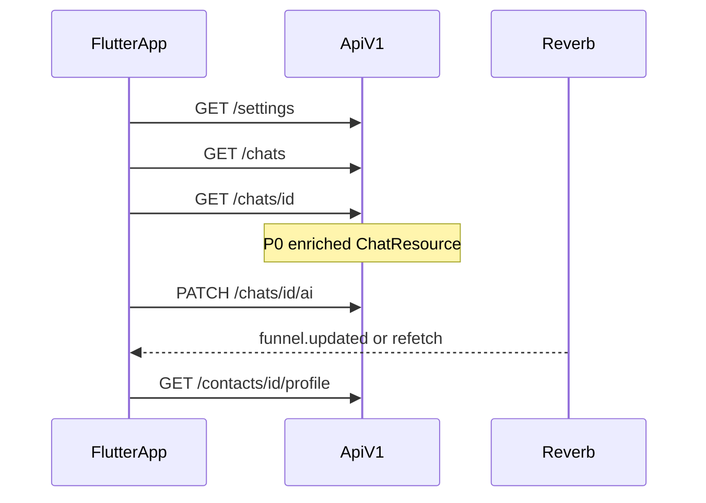
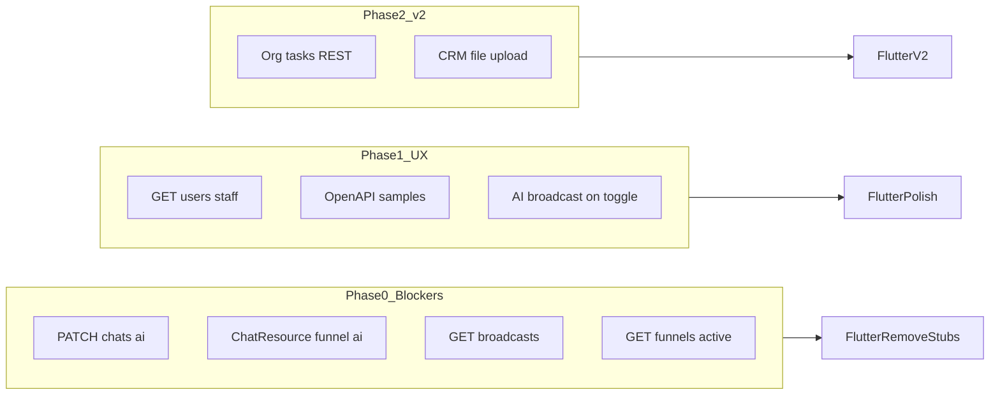
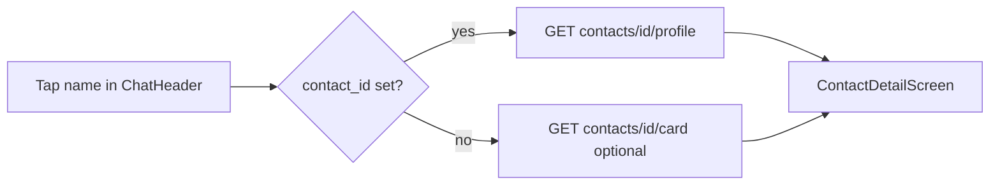

# Accel — руководство по внедрению Mobile API в Flutter

**Версия:** API v1 · **Дата:** 2026-06-03  
**Аудитория:** backend (Laravel), mobile (Flutter), QA

Пошаговая инструкция: как перенести **все функции** из [MOBILE_API_NEEDS.md](./MOBILE_API_NEEDS.md) в мобильное приложение — что доработать на сервере, как подключить во Flutter, в каком порядке выкатывать и как принять работу.

---

## Содержание

1. [Карта документов](#1-карта-документов)
2. [Архитектура и предпосылки](#2-архитектура-и-предпосылки)
3. [Фазы внедрения](#3-фазы-внедрения)
4. [Матрица: функция → backend → Flutter → готовность](#4-матрица-функция--backend--flutter--готовность)
5. [Фактические JSON-контракты (расхождения с MOBILE_API_NEEDS)](#5-фактические-json-контракты)
6. [Phase 0 — снятие заглушек (блокеры UI)](#6-phase-0--снятие-заглушек)
7. [Phase 1 — UX, realtime, OpenAPI](#7-phase-1--ux-realtime-openapi)
8. [Phase 2 — v2 (отдельные эпики)](#8-phase-2--v2)
9. [Flutter: структура репозитория и экраны](#9-flutter-структура-репозитория-и-экраны)
10. [Realtime (Reverb)](#10-realtime-reverb)
11. [Тестирование и rollout](#11-тестирование-и-rollout)
12. [Приложения: файлы backend, curl, диаграммы](#12-приложения)

---

## 1. Карта документов

| Документ | Назначение | Когда читать |
|----------|------------|--------------|
| **[MOBILE_API_NEEDS.md](./MOBILE_API_NEEDS.md)** | Что не хватает API, приоритеты, sample JSON (часть устарела) | Product / backend backlog |
| **[FLUTTER_MOBILE_UI.md](./FLUTTER_MOBILE_UI.md)** | Tab bar, экраны, веб-референсы (Vue), UX mobile | Flutter UI/UX |
| **[FEATURES_BY_ROLE.md](./FEATURES_BY_ROLE.md)** | Полный каталог функций, ~98 routes, роли | Справочник endpoints |
| **[README.md](./README.md)** | Sanctum, Reverb, быстрый старт | Onboarding |
| **Этот файл** | **Как внедрить** end-to-end: код, порядок, acceptance | Реализация |

OpenAPI: [`openapi/mobile-v1.yaml`](../../openapi/mobile-v1.yaml) · Swagger: `https://{slug}.accel.kz/docs/api`

---

## 2. Архитектура и предпосылки

### 2.1 Мультитенантность

```
https://{slug}.accel.kz/api/v1/...
```

- Пользователь вводит **slug** (рабочее пространство) до логина.
- Токен Sanctum привязан к tenant; все запросы — на поддомен slug.
- `GET /api/v1/workspace` — публичная проверка tenant (без токена).

### 2.2 Аутентификация

| Шаг | Endpoint | Результат |
|-----|----------|-----------|
| Логин | `POST /api/v1/auth/login` или `login/pin` | `token`, `user`, `tenant` |
| Профиль | `GET /api/v1/auth/me` | актуальный user |
| Запросы | Header `Authorization: Bearer {token}` | |
| Realtime auth | `POST /broadcasting/auth` | подписка на private channels |

### 2.3 Модули и роли

После логина: **`GET /api/v1/settings`** → объект `modules` (флаги `module_chats`, `module_funnels`, `module_broadcasts`, …).

Скрывайте вкладки TabBar, если модуль `off` или роль не допускает действие (см. [FEATURES_BY_ROLE.md](./FEATURES_BY_ROLE.md)).

Роли Spatie: `administrator`, `manager`, `employee`.

### 2.4 Поток данных (целевой)



---

## 3. Фазы внедрения



| Фаза | Срок (ориентир) | Backend | Flutter |
|------|-----------------|---------|---------|
| **P0** | 1–2 спринта | 4 новых/расширенных endpoint | Снять заглушки AI, рассылки, picker воронок |
| **P1** | 1 спринт | users list, broadcast AI event, OpenAPI | Полировка парсинга, sender dropdown |
| **P2** | эпик | tasks API, multipart CRM | Organization, файлы в карточке |

**Порядок деплоя:** backend P0 → обновить OpenAPI → release Flutter (с fallback на старые контракты, см. §11).

---

## 4. Матрица: функция → backend → Flutter → готовность

| Функция | Mobile API сейчас | Backend (что сделать) | Flutter (что сделать) | Критерий готовности |
|---------|-------------------|----------------------|-------------------------|---------------------|
| Вход, модули | ✅ login, settings | — | Workspace + ModuleGate | Логин на demo, tabs по modules |
| Inbox чаты | ✅ `GET /chats` | P0: funnel fields в list (опц.) | Список + Reverb list channel | Realtime обновляет preview |
| Сообщения | ✅ messages CRUD | — | Chat screen | Отправка/медиа/read |
| **AI toggle** | ❌ | **P0:** `PATCH /chats/{id}/ai` | Switch вместо «скоро» | Toggle синхронен с вебом |
| AI панель в чате | ✅ `POST .../ai/chat` | — | Bottom sheet / panel | Не путать с toggle |
| **Funnel bar в чате** | ⚠️ workaround | **P0:** расширить `ChatResource` | Убрать лишний `board/card` | Одна загрузка чата |
| Funnel modal | ✅ `PATCH funnel`, history | — | Modal + catalog из ответа | Сохранение этапа |
| Доска воронок | ✅ `board/*` | P0: `GET /funnels/active` | Picker + scope по роли | Карточки видны как на вебе |
| Клиенты | ✅ contacts/* | — | Подтаб + profile | `profile.sections[]` рендер |
| Карточка из чата | ✅ profile, `contact_id` в chat | — | Tap header → ContactDetail | Открывается по `contact_id` |
| Рассылки | ⚠️ нет list | **P0:** `GET /broadcasts` | List вместо SharedPreferences | История кампаний с сервера |
| AI workspace tab | ✅ `ai-chat/query` | P1: samples OpenAPI | Парсить `reply` top-level | Ответ не пустой на demo |
| Календарь | ✅ CRUD events | — | Парсить **массив** корня | События в диапазоне видны |
| Staff для рассылок | ❌ | **P1:** `GET /users` | Dropdown sender (admin) | Admin выбирает отправителя |
| Звонки UI | — | Не делать | Не делать | — |
| Org tasks | web only | **P2** REST | Убрать web-scrape | — |
| CRM file upload | web only | **P2** multipart | — | — |

---

## 5. Фактические JSON-контракты

Сверка с кодом Laravel (июнь 2026). Если Flutter парсит иначе — UI «пустой» при рабочем API.

### 5.1 Сводная таблица расхождений

| Endpoint | В MOBILE_API_NEEDS (устарело) | **Факт в Laravel** | Действие Flutter |
|----------|-------------------------------|--------------------|------------------|
| `POST /ai-chat/query` | `data.reply` | Корень: `reply`, `intent`, `contacts`, `media`, … | `json['reply']` |
| `GET /calendar/events` | `{ "data": [...] }` | **JSON-массив** событий | `List<dynamic>.from(response.data)` |
| `GET /funnels/board/data` | вариант с обёрткой `data` | `{ "funnel", "stages" }` | Парсить корень |
| `GET /contacts/{id}/profile` | `data.sections`, `data.id` | `{ "profile": { contact_id, display_name, sections[] } }` | `json['profile']` |
| `GET /api/v1/chats` | «нет contact_id» | **`contact_id` есть** в [`ChatResource`](../../app/Http/Resources/Api/V1/ChatResource.php) | Paginated: `data[i].contact_id` |
| `GET /api/v1/chats/{id}` | нет funnel/ai | Пока нет в resource | После P0 — те же поля |
| `GET /chats/{id}/funnel/history` | — | `{ "data": [ items ] }` | `json['data']` |
| `PATCH /chats/{id}/funnel` | — | `{ success, chat, funnel_catalog }` | Не ожидать Laravel Resource wrapper |

### 5.2 `POST /api/v1/ai-chat/query`

**Request:**

```json
{
  "message": "Сделки на этапе Переговоры",
  "history": [
    { "role": "user", "content": "..." },
    { "role": "assistant", "content": "..." }
  ]
}
```

**Response 200** ([`AiWorkspaceService::handle`](../../app/Services/AI/AiWorkspaceService.php)) — **без** обёртки `data`:

```json
{
  "reply": "На этапе «Переговоры» сейчас 12 сделок.",
  "intent": "funnel_deals",
  "contacts": [{ "id": 45, "name": "Иван", "phone_number": "+7700..." }],
  "funnel_deals": [],
  "calendar_events": [],
  "visualizations": [],
  "client_summary": null,
  "filters_applied": { "funnel": {}, "contacts": null }
}
```

**Ошибки:** 422 `{ "message": "..." }`, 403 если `module_ai_chat` off.

**Flutter:** `AiWorkspaceRepository.query()` → модель с полем `reply`; опционально карточки из `contacts[]` (deep link в `ContactDetailScreen`).

### 5.3 `GET /api/v1/calendar/events`

**Query** ([`CalendarController::events`](../../app/Http/Controllers/CalendarController.php)):

| Параметр | Обязательный | Значения |
|----------|--------------|----------|
| `start` | да | date `YYYY-MM-DD` |
| `end` | да | date, `>= start` |
| `filter` | нет | `all` (default), `mine`, `assigned_to_me` |
| `author_id`, `assignee_id` | нет | только из разрешённого списка |

**Response:** массив (не объект), элемент из [`transformEvent`](../../app/Services/Calendar/CalendarEventsInRangeCollector.php):

```json
[
  {
    "id": 1,
    "title": "Встреча",
    "starts_at": "2026-06-02T10:00:00+05:00",
    "ends_at": "2026-06-02T11:00:00+05:00",
    "all_day": false,
    "color": "#25d366",
    "owner": { "id": 2, "name": "Менеджер" },
    "assignee": null,
    "chat": { "id": 10, "name": "Клиент" },
    "contact": { "id": 45, "name": "Иван", "phone_number": "+7700..." }
  }
]
```

**Flutter:** запрашивать диапазон **≥ видимый месяц** (например −7 / +60 дней); `DateTime.parse(starts_at)` с offset.

### 5.4 `GET /api/v1/funnels/board/data`

**Query:** `funnel_id` (required), `scope` (`all`|`mine`|`department`, default **`all`**), опционально `assignee_id`, `department_id`, `whatsapp_session_id`, `search`.

**Response** (корень):

```json
{
  "funnel": { "id": 1, "name": "Универсальная продажа", "color": "#01b964" },
  "stages": [
    {
      "id": 10,
      "name": "Новый",
      "cards": [],
      "cards_total": 0,
      "has_more": false
    }
  ]
}
```

**Scope по роли (рекомендация для Flutter):**

| Роль | `scope` по умолчанию |
|------|----------------------|
| administrator | `all` |
| manager | `department` |
| employee | `mine` |

Admin на вебе часто смотрит `all`; если mobile слал `mine` — доска пустая при данных на вебе.

### 5.5 `GET /api/v1/contacts/{id}/profile`

**Query:** `chat_id` (optional), `with_ai=1` (optional).

**Response:**

```json
{
  "profile": {
    "contact_id": 45,
    "display_name": "Иван Петров",
    "sections": [
      {
        "key": "basic",
        "title": "Основное",
        "semantic": "who",
        "fields": [
          { "label": "Имя", "value": "Иван Петров", "editable": true, "type": "text" }
        ]
      }
    ],
    "memory": {
      "content": "",
      "updated_at": null,
      "memory_contact_id": null
    }
  }
}
```

Секции: `basic`, контакты, finance, b2b, history, tasks — см. [`ClientProfileAssembler`](../../app/Services/Contact/ClientProfileAssembler.php).

**Flutter:** виджет секций по `sections[].title` + `fields[]`; не ожидать `profile.id` / `profile.phone` на верхнем уровне (телефон внутри fields).

### 5.6 `GET /api/v1/chats` (paginated)

Laravel Resource collection:

```json
{
  "data": [
    {
      "id": 123,
      "contact_id": 45,
      "chat_name": "Иван",
      "unread_count": 2,
      "contact": { "id": 45, "name": "Иван", "phone_number": "+7700..." }
    }
  ],
  "links": { "...": "..." },
  "meta": { "current_page": 1, "last_page": 5 }
}
```

После P0 в элементах list могут появиться `funnel_stage_id`, `ai_enabled` (nullable для обратной совместимости).

---

## 6. Phase 0 — снятие заглушек

### 6.1 `PATCH /api/v1/chats/{chat}/ai`

**Зачем:** Switch автоответа AI в шапке чата (сейчас заглушка «скоро» в Flutter).

#### Backend — шаги

1. **Маршрут** в [`routes/api-tenant.php`](../../routes/api-tenant.php) после строки `chats/{chat}/ai/chat`:

```php
Route::patch('chats/{chat}/ai', [ChatAiSettingsController::class, 'update'])
    ->middleware('throttle:30,1');
```

   Либо тонкая обёртка `Api\V1\ChatAiSettingsController`, делегирующая в существующий контроллер.

2. **Логика:** [`ChatAiSettingsController::update`](../../app/Http/Controllers/ChatAiSettingsController.php) — policy `manageAi`, validation:

| Поле | Правило |
|------|---------|
| `ai_enabled` | required bool |
| `ai_mode` | nullable `auto` \| `draft` |
| `ai_responder_user_id` | nullable exists users |
| `confirm_risky_enable` | sometimes bool |

3. **Нормализовать ответ для mobile** (веб отдаёт сырой Eloquent `chat`):

**200:**

```json
{
  "data": {
    "id": 123,
    "ai_enabled": true,
    "ai_mode": "auto",
    "ai_responder_user_id": 5,
    "contact_id": 45,
    "funnel_id": 2,
    "funnel_stage_id": 7
  },
  "requires_confirmation": false,
  "warnings": []
}
```

**422 risky:**

```json
{
  "message": "Перед включением AI проверьте готовность системы.",
  "requires_confirmation": true,
  "warnings": ["..."],
  "readiness": {},
  "settings_url": "https://{slug}.accel.kz/settings/ai-quality"
}
```

4. **P1 (рекомендуется):** после успешного save — `broadcast(new ChatAiOrchestratorUpdated($chat->id, ['ai_enabled' => ..., 'ai_mode' => ...]))` — сейчас toggle **не** шлёт WS; только orchestrator в других путях.

5. **Тест:** `tests/Feature/Api/V1/ChatAiSettingsTest.php` — admin OK; manager на назначенном чате; 403 на чужом; 422 с `requires_confirmation`.

6. **OpenAPI:** path + schemas в [`openapi/mobile-v1.yaml`](../../openapi/mobile-v1.yaml).

#### Flutter — шаги

| Файл / зона | Действие |
|-------------|----------|
| `lib/features/chat/chat_screen.dart` (~1687) | Заменить badge «скоро» на `Switch` |
| `lib/data/repositories/chat_repository.dart` | `patchAiSettings(chatId, { ai_enabled, confirm_risky_enable })` |
| UI | `AlertDialog` при `requires_confirmation`; повтор PATCH с `confirm_risky_enable: true` |
| State | После 200 — обновить local `ChatModel` или `GET /chats/{id}` |

**Acceptance:** на demo tenant toggle меняет AI на веб-чате; после перезахода в чат состояние совпадает.

---

### 6.2 Расширение `ChatResource`

**Зачем:** полоска воронки + AI badge без `GET /funnels/board/card/{chat}`.

#### Backend — шаги

1. [`ChatResource::toArray`](../../app/Http/Resources/Api/V1/ChatResource.php) — добавить скаляры с модели `Chat`:

   - `ai_enabled`, `ai_mode`, `ai_responder_user_id`
   - `funnel_id`, `funnel_stage_id`, `funnel_tracking_enabled`, `funnel_stage_locked`

2. Внедрить [`ChatFunnelStateService::inertiaExtras`](../../app/Services/Funnel/ChatFunnelStateService.php):

```php
'extras' => app(ChatFunnelStateService::class)->inertiaExtras($this->resource),
```

   Ключи в JSON (как на вебе): `funnel`, `funnel_stage`, `funnel_progress_percent`, `funnel_progress`.

3. Опционально для модалки: `funnel_catalog` только в `show` (тяжелее) — или оставить загрузку через `PATCH funnel` / отдельный `GET /funnels/active`.

4. [`Api\V1\ChatController::show`](../../app/Http/Controllers/Api/V1/ChatController.php) — `load(['funnel', 'funnelStage'])`.

5. **`index` (опционально v1.1):** те же 4–5 полей для badge в inbox без N+1 (eager load funnelStage).

6. Feature test: snapshot JSON `GET /api/v1/chats/{id}` содержит `ai_enabled` и `funnel`.

#### Flutter — шаги

| Компонент | Действие |
|-----------|----------|
| `ChatModel` | Поля nullable `aiEnabled`, `funnel`, `funnelStage`, `funnelProgress` |
| Funnel strip | Рендер из `chat.funnel` / `funnel_progress.stage_index` |
| Fallback | Если `funnel == null` && API старый — один запрос `GET /funnels/board/card/{chat}?funnel_id=` |
| Inbox | Badge этапа из `funnel_stage_id` когда появится в list |

**Acceptance:** открытие чата — **один** GET; полоска отображается без второго запроса.

---

### 6.3 `GET /api/v1/broadcasts`

**Зачем:** экран «Последние рассылки» ([FLUTTER_MOBILE_UI.md §3.1](./FLUTTER_MOBILE_UI.md)).

#### Backend — шаги

1. Метод `index` в [`BroadcastController`](../../app/Http/Controllers/BroadcastController.php) **или** `Api\V1\BroadcastController`.

2. Переиспользовать [`campaignPayload`](../../app/Http/Controllers/BroadcastController.php) (как web `index`, limit 20 → pagination):

```http
GET /api/v1/broadcasts?page=1&per_page=20
```

3. **Response (зафиксировать стиль Laravel pagination):**

```json
{
  "data": [
    {
      "id": 42,
      "status": "running",
      "source": "excel",
      "ready_count": 120,
      "sent_count": 45,
      "skipped_count": 3,
      "failed_count": 0,
      "started_at": "2026-06-02T10:00:00Z",
      "completed_at": null,
      "session": { "id": 1, "label": "Основной" },
      "sender": { "id": 2, "name": "Менеджер" }
    }
  ],
  "meta": { "current_page": 1, "last_page": 3 }
}
```

4. Route в группе `role:administrator,manager` (как `store`/`preview`).

5. Тест + OpenAPI.

#### Flutter — шаги

| Экран | API |
|-------|-----|
| BroadcastsListScreen | `GET /broadcasts` |
| BroadcastDetailScreen | `GET /broadcasts/{id}` (уже есть) |
| Wizard | `POST preview`, `POST /broadcasts` |

Удалить workaround: хранение только ID в `SharedPreferences`.

**Acceptance:** список кампаний совпадает с веб `/broadcasts` для manager/admin.

---

### 6.4 `GET /api/v1/funnels/active`

**Зачем:** picker воронки на доске и первый запуск (сейчас нет list для staff).

#### Backend — шаги

1. Новый action, например в [`FunnelBoardController`](../../app/Http/Controllers/FunnelBoardController.php):

```php
public function activeFunnels(Request $request): JsonResponse
{
    $this->ensureModuleEnabled();
    $funnels = $this->boardService->activeFunnels()
        ->map(fn ($f) => [
            'id' => (int) $f->id,
            'name' => (string) $f->name,
            'color' => (string) ($f->color ?: '#01b964'),
            'description' => $f->description,
        ])->values();

    return response()->json(['data' => $funnels]);
}
```

2. Route: `Route::get('funnels/active', ...)` в auth group (не только administrator CRUD).

3. Опционально: `default_funnel_id` в `GET /settings` из [`SystemSetting`](../../app/Models/SystemSetting.php) / user preference.

4. Тест: manager получает 200 и ≥1 воронку на demo.

#### Flutter — шаги

| Действие | Деталь |
|----------|--------|
| Picker | `Dropdown` / bottom sheet из `GET /funnels/active` |
| Persistence | `SharedPreferences` / secure storage: `last_funnel_id` |
| First launch | Если нет сохранённого — `data[0].id` или `default_funnel_id` |
| Board load | `GET /funnels/board/data?funnel_id=&scope=` |

**Acceptance:** manager видит те же воронки, что веб Board picker.

---

## 7. Phase 1 — UX, realtime, OpenAPI

### 7.1 `GET /api/v1/users` (staff)

**Зачем:** administrator выбирает **отправителя** рассылки (веб: [`senderOptionsFor`](../../app/Http/Controllers/BroadcastController.php)).

#### Backend

- `GET /api/v1/users` → `{ "data": [{ "id", "name", "email" }] }`
- Query: active only; tenant scope.
- Policy: `administrator` full list; `manager` — только себя (как web) **или** document parity с web.

#### Flutter

- В wizard рассылки: если `user.role == administrator` — dropdown; иначе скрыть, `sender_user_id` = current user.

---

### 7.2 Realtime

| Канал | Событие (`broadcastAs`) | Когда обновлять UI |
|-------|-------------------------|-------------------|
| `private-t.{companyId}.chat.{chatId}` | `.message.received` | Сообщения |
| тот же | `.user.typing` | Индикатор печати |
| тот же | `.funnel.updated` | Полоска воронки ([`ChatFunnelUpdated`](../../app/Events/ChatFunnelUpdated.php)) |
| тот же | `.ai-orchestrator.updated` | AI orchestrator state |
| `private-t.{companyId}.funnel-board.{funnelId}` | `.card.updated` | Доска ([`FunnelBoardCardUpdated`](../../app/Events/FunnelBoardCardUpdated.php)) |
| `private-t.{companyId}.chats.list.{userId}` | list refresh | Inbox |

**Важно:** `PATCH /chats/{id}/ai` сегодня **не** эмитит событие — после toggle делайте **refetch** `GET /chats/{id}` или добавьте broadcast в P1.

**Flutter:** подписка в `initState` чата/доски; `dispose` — отписка; auth через Bearer на `/broadcasting/auth`.

Подробнее: [FLUTTER_MOBILE_UI.md §10](./FLUTTER_MOBILE_UI.md), [FEATURES_BY_ROLE.md](./FEATURES_BY_ROLE.md).

---

### 7.3 OpenAPI — чеклист

В [`openapi/mobile-v1.yaml`](../../openapi/mobile-v1.yaml):

- [ ] `PATCH /chats/{chat}/ai` + examples 200/422
- [ ] `GET /broadcasts` + pagination
- [ ] `GET /funnels/active`
- [ ] `GET /users` (P1)
- [ ] Расширить schema `Chat`: `contact_id`, `ai_*`, `funnel_*`, nested `funnel` / `funnel_progress`
- [ ] Examples: `GET /funnels/board/data`, `GET /calendar/events`, `POST /ai-chat/query`, `GET /contacts/{id}/profile`

Публикуйте примеры с **demo** tenant в комментариях к PR для QA.

---

## 8. Phase 2 — v2

| Эпик | Backend | Flutter | Ссылка |
|------|---------|---------|--------|
| Organization tasks | REST read/CRUD department posts | Убрать web-fallback на OrganizationPage | web `routes/tenant.php` |
| CRM file fields | `multipart` на fields или upload URL | File picker в ContactDetail | [`ContactController::updateFields`](../../app/Http/Controllers/ContactController.php) |
| Team chat tab | API уже есть (`/team-chat/*`) | Отдельный tab v1.1 | FEATURES_BY_ROLE |
| Entity memory | web only | Не блокирует v1 | — |
| B2B companies | web only | — | — |

---

## 9. Flutter: структура репозитория и экраны

Код Flutter в **отдельном репозитории**; ниже — целевая структура и привязка к TabBar ([FLUTTER_MOBILE_UI.md §2](./FLUTTER_MOBILE_UI.md)).

### 9.1 Каталоги

```
lib/
  config/env.dart              # ROOT_DOMAIN, REVERB_*
  core/
    api/dio_client.dart        # Bearer, 401 → logout
    api/api_exception.dart
    modules/module_gate.dart   # settings.modules
    realtime/reverb_service.dart
  data/
    models/                    # ChatModel, ContactProfile, BoardPayload, ...
    repositories/              # ChatRepository, FunnelRepository, ...
  features/
    auth/
    chats/                     # inbox, chat_screen, contact from header
    funnels/                   # board + clients sub-tabs
    broadcasts/
    ai_workspace/
    calendar/
    contacts/
    profile/
```

### 9.2 Tab → feature → endpoints

| Tab | Экраны | Ключевые endpoints |
|-----|--------|-------------------|
| Чаты | Inbox, Chat, Broadcasts (menu) | `GET /chats`, messages, **P0** `PATCH .../ai`, contacts |
| Воронки | Board, Clients | **P0** `funnels/active`, `board/data`, `contacts` |
| AI | AiWorkspace | `POST /ai-chat/query` |
| Календарь | Month, EventForm | `calendar/events` |
| Профиль | Settings, modules | `GET /settings`, sessions |

### 9.3 Чеклист интеграции Flutter (расширенный)

#### Foundation

- [ ] Slug + `GET /workspace`
- [ ] Login + secure token storage
- [ ] `GET /settings` → `ModuleGate`
- [ ] Dio interceptors + 422 field errors
- [ ] Reverb + `/broadcasting/auth`

#### Чаты (после P0 backend)

- [ ] Inbox paginated `data[]`, `contact_id` для навигации
- [ ] Chat: messages, send, media, assign
- [ ] Header tap → `GET /contacts/{id}/profile?chat_id=`
- [ ] Funnel strip + modal (`PATCH funnel`, `GET history`)
- [ ] **AI Switch** — `PATCH /chats/{id}/ai` (убрать заглушку)
- [ ] Меню → Broadcasts list (**P0** `GET /broadcasts`)
- [ ] **Не делать** call UI

#### Воронки (после P0)

- [ ] `GET /funnels/active` + saved `funnel_id`
- [ ] Board: `board/data`, `stage-cards`, drag → `bulk-move` / `PATCH funnel`
- [ ] Clients sub-tab: `GET /contacts`
- [ ] Reverb `funnel-board.{id}` → `.card.updated`

#### AI + Calendar

- [ ] AI tab: парсить `reply` с корня ответа
- [ ] Calendar: массив событий, `start`/`end` query

#### Обратная совместимость

- [ ] Если `chat.ai_enabled == null` — считать API до P0, скрыть Switch или показать «обновите сервер»
- [ ] Funnel strip fallback на `board/card`

---

## 10. Realtime (Reverb)

### 10.1 Подключение

1. Env: host, port, app key (из backend `.env` / handoff doc).
2. `POST https://{slug}.accel.kz/broadcasting/auth` с Bearer.
3. Body: `{ "channel_name": "private-t.1.chat.42", "socket_id": "..." }`.

### 10.2 Обработчики в приложении

```dart
// Псевдокод
channel.bind('.funnel.updated', (e) => refetchChatFunnelState());
channel.bind('.card.updated', (e) => patchBoardCard(e.payload));
channel.bind('.message.received', (e) => appendMessage(e));
```

Payload `.funnel.updated` совпадает с [`ChatFunnelStateService` broadcast payload](../../app/Services/Funnel/ChatFunnelStateService.php): `funnel`, `stage`, `funnel_progress`, `funnel_tracking_enabled`, …

---

## 11. Тестирование и rollout

### 11.1 Backend automated

```bash
php artisan test tests/Feature/Api/V1/
```

Добавить при P0:

- `ChatAiSettingsTest`
- `BroadcastsIndexTest`
- `FunnelsActiveTest`
- `ChatResourceFunnelFieldsTest`

### 11.2 Manual QA matrix (demo tenant)

| Сценарий | administrator | manager | employee |
|----------|---------------|---------|----------|
| AI toggle в назначенном чате | ✅ | ✅ | ✅ если assigned |
| AI toggle в чужом чате | ✅ | 403 | 403 |
| Доска `scope=all` / department / mine | all | department | mine |
| Список рассылок | ✅ | ✅ | скрыт |
| Profile из чата | ✅ | ✅ | ✅ |
| AI workspace query | ✅ | ✅ | ✅ если module on |

### 11.3 curl-примеры (подставьте TOKEN и slug)

```bash
SLUG=demo
TOKEN="..."
BASE="https://${SLUG}.accel.kz/api/v1"

# Модули
curl -s "$BASE/settings" -H "Authorization: Bearer $TOKEN" | jq .modules

# Чат (до/после P0 — сравнить поля)
curl -s "$BASE/chats/123" -H "Authorization: Bearer $TOKEN" | jq

# AI toggle (после P0)
curl -s -X PATCH "$BASE/chats/123/ai" \
  -H "Authorization: Bearer $TOKEN" -H "Content-Type: application/json" \
  -d '{"ai_enabled":true,"ai_mode":"auto","confirm_risky_enable":false}' | jq

# Доска
curl -s "$BASE/funnels/board/data?funnel_id=1&scope=all" \
  -H "Authorization: Bearer $TOKEN" | jq '.funnel,.stages|length'

# Календарь (массив!)
curl -s "$BASE/calendar/events?start=2026-06-01&end=2026-06-30&filter=all" \
  -H "Authorization: Bearer $TOKEN" | jq 'length'

# AI workspace
curl -s -X POST "$BASE/ai-chat/query" \
  -H "Authorization: Bearer $TOKEN" -H "Content-Type: application/json" \
  -d '{"message":"Сколько сделок в воронке?"}' | jq .reply

# Профиль
curl -s "$BASE/contacts/45/profile?chat_id=123" \
  -H "Authorization: Bearer $TOKEN" | jq .profile.sections
```

### 11.4 Rollback

- **Backend откат:** старые клиенты продолжают работать; новые поля в JSON optional.
- **Flutter:** feature-detect по наличию `ai_enabled` в `GET /chats/{id}`; funnel strip — fallback `board/card`.

### 11.5 Порядок релизов

1. Deploy backend P0 на staging `{slug}`.
2. Прогон curl + QA matrix.
3. Обновить `openapi/mobile-v1.yaml` на сервере docs.
4. Release Flutter с P0 интеграцией.
5. P1 backend + Flutter minor.
6. P2 — отдельные тикеты.

---

## 12. Приложения

### 12.1 Файлы backend по задачам P0

| Задача | Файлы |
|--------|-------|
| PATCH ai | `routes/api-tenant.php`, `ChatAiSettingsController.php`, (optional) `Api/V1/ChatAiSettingsController.php`, `tests/Feature/Api/V1/ChatAiSettingsTest.php`, `openapi/mobile-v1.yaml` |
| ChatResource | `app/Http/Resources/Api/V1/ChatResource.php`, `Api/V1/ChatController.php`, `ChatFunnelStateService.php` |
| GET broadcasts | `BroadcastController.php`, `routes/api-tenant.php`, tests, openapi |
| GET funnels/active | `FunnelBoardController.php`, `FunnelBoardService.php`, `routes/api-tenant.php`, tests, openapi |

### 12.2 Уже работающие mobile routes (не дублировать)

См. полный список в [`routes/api-tenant.php`](../../routes/api-tenant.php): чаты, messages, `PATCH chats/{chat}/funnel`, `funnels/board/*`, contacts, `ai-chat/query`, calendar, broadcasts preview/store/show.

### 12.3 Flutter-экраны (целевые файлы)

| UX | См. FLUTTER_MOBILE_UI | Типичный путь в Flutter repo |
|----|----------------------|------------------------------|
| AI toggle заглушка | §3.3.B | `lib/features/chat/chat_screen.dart` |
| Funnel strip | §3.3.C | `chat_header.dart` / funnel_widgets |
| Broadcasts menu | §3.1 | `broadcasts_list_screen.dart` |
| Board kanban | §4 | `funnel_board_screen.dart` |
| Clients | §7 | `clients_tab.dart`, `contact_detail_screen.dart` |
| AI tab | §5 | `ai_workspace_screen.dart` |
| Calendar | §6 | `calendar_screen.dart` |

### 12.4 Диаграмма: чат → CRM карточка



`contact_id` уже приходит в `GET /chats` / `GET /chats/{id}` — не запрашивайте отдельно, если не null.

---

## Связанные документы

| Файл | Описание |
|------|----------|
| [MOBILE_API_NEEDS.md](./MOBILE_API_NEEDS.md) | Backlog потребностей API |
| [FLUTTER_MOBILE_UI.md](./FLUTTER_MOBILE_UI.md) | Спецификация экранов |
| [FEATURES_BY_ROLE.md](./FEATURES_BY_ROLE.md) | Функции и роли |
| [README.md](./README.md) | Быстрый старт API |

---

*При добавлении endpoints обновляйте этот файл, MOBILE_API_NEEDS.md (чеклисты) и openapi/mobile-v1.yaml.*
