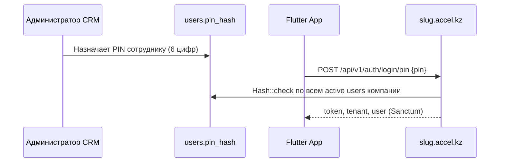

# PIN-вход в Accel (Mobile API)

Быстрый вход по цифровому PIN — альтернатива email/password для сотрудников тенанта. На веб-CRM PIN уже используется на странице логина; в Mobile API v1 доступен отдельный эндпоинт.

См. также: [Mobile API README](./README.md), [инструкция для Flutter-агента](../mobile-app/AGENT.md).

## Как это работает



| Параметр | Значение |
|----------|----------|
| Формат PIN | **6 цифр** (`/^\d{6}$/`) |
| Хранение | `users.pin_hash` — bcrypt (Laravel `hashed` cast) |
| Область | Один PIN уникален **внутри компании** (тенанта) |
| Кто может войти | Активный сотрудник (`is_active: true`), не super-admin |
| Где задаётся PIN | Веб CRM → Настройки → Пользователи (поле `pin` при create/update) |

PIN **не задаётся** через Mobile API — только администратор в CRM.

## API

### Вход по PIN

```http
POST https://{slug}.accel.kz/api/v1/auth/login/pin
Content-Type: application/json
Accept: application/json

{"pin": "482901"}
```

**Успех (200):** тот же формат, что и email-login:

```json
{
  "token": "1|…",
  "token_type": "Bearer",
  "tenant": {
    "id": 1,
    "slug": "demo",
    "name": "Demo",
    "is_active": true,
    "subscription_status": "active"
  },
  "user": {
    "id": 42,
    "name": "Иван",
    "email": "ivan@example.com",
    "roles": ["employee"]
  }
}
```

Дальнейшие запросы — с `Authorization: Bearer {token}`.

### Ошибки

| HTTP | Причина | Тело |
|------|---------|------|
| 422 | Неверный PIN, PIN не настроен, неверный формат | `{"errors": {"pin": ["…"]}}` |
| 403 | Аккаунт деактивирован | `{"message": "Ваш аккаунт деактивирован."}` |
| 403 | Тенант suspended/canceled | `{"message": "…", "reason": "suspended"}` |
| 429 | Rate limit (8 попыток / IP + company, 25 / company) | throttle message на поле `pin` |

Throttle keys: `pin|{company_id}|{ip}` и `pin-company|{company_id}`.

### Пример curl

```bash
curl -s -X POST "https://demo.accel.kz/api/v1/auth/login/pin" \
  -H "Content-Type: application/json" \
  -H "Accept: application/json" \
  -d '{"pin":"482901"}' | jq
```

## Назначение PIN (веб CRM)

Администратор в `https://{slug}.accel.kz/settings/users`:

- при **создании** или **редактировании** пользователя — поле `pin` (строка из 6 цифр);
- пустая строка — **снять** PIN (`pin_hash = null`);
- дубликат PIN в той же компании → ошибка валидации: «Этот PIN уже используется другим сотрудником.»

Backend: [`UserPinService`](../../app/Services/Auth/UserPinService.php), [`UserManagementController`](../../app/Http/Controllers/UserManagementController.php).

## Flutter: рекомендуемый UX

### Экран входа

1. После выбора workspace (`slug`) показать переключатель:
   - **Email + пароль** → `POST /api/v1/auth/login`
   - **PIN** → `POST /api/v1/auth/login/pin`
2. PIN-pad: 6 цифр, кнопка «Войти» активна при `length === 6`.
3. Не сохранять PIN в persistent storage — только в памяти на время ввода.
4. После успеха — сохранить **token** в `flutter_secure_storage` (как при email-login).

### Локальная блокировка приложения (опционально)

PIN API — это **server-side** аутентификация, не app lock. Если нужен локальный PIN/biometric после первого login:

- первый вход — email или server PIN → получить Bearer token;
- последующие открытия — проверять локальный PIN/Face ID, затем использовать сохранённый token;
- при 401 от API — полный re-login (server PIN или email).

### Widget

На вебе используется [`PinLoginPad`](../../resources/js/Components/Auth/PinLoginPad.vue): сетка 0–9, Clear, Backspace, 6 точек-индикаторов. В Flutter воспроизведите аналогичный UX.

## Безопасность

- PIN слабее пароля — используйте для доверенных устройств операторов, не для админов супер-панели.
- Super-admin (`app.accel.kz`) **не** поддерживает PIN-login.
- При смене пароля пользователя Sanctum-токены отзываются; PIN при этом не меняется автоматически.
- При деактивации пользователя (`is_active: false`) PIN-login возвращает 403.
- Не логируйте PIN в analytics/crash reports.

## Связанный код

| Файл | Роль |
|------|------|
| [`MobilePinLoginRequest`](../../app/Http/Requests/Api/V1/MobilePinLoginRequest.php) | Валидация + rate limit API |
| [`PinLoginRequest`](../../app/Http/Requests/Auth/PinLoginRequest.php) | Веб-сессия `/login/pin` |
| [`AuthController::loginPin`](../../app/Http/Controllers/Api/V1/AuthController.php) | Выдача Sanctum token |
| [`UserPinService`](../../app/Services/Auth/UserPinService.php) | Hash, uniqueness, lookup |
| [`tests/Feature/Api/V1/MobilePinAuthTest.php`](../../tests/Feature/Api/V1/MobilePinAuthTest.php) | API-тесты |

## Тесты

```bash
php artisan test tests/Feature/Api/V1/MobilePinAuthTest.php
php artisan test tests/Feature/Auth/PinAuthenticationTest.php
```
