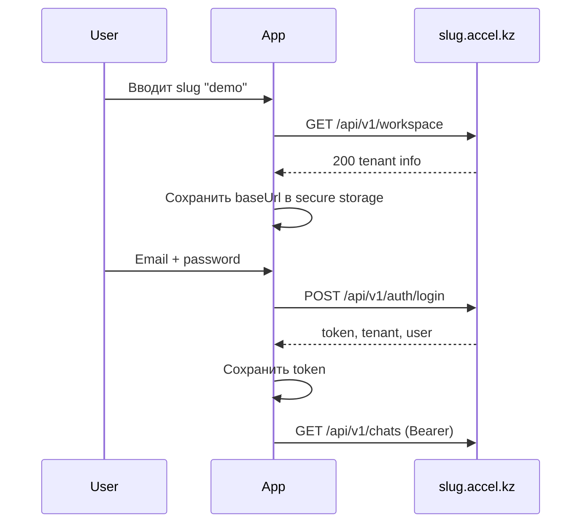

# Accel Flutter — инструкция для Cursor Agent

> Скопируйте этот файл в корень Flutter-проекта как `AGENTS.md` или `.cursor/rules/accel-backend.mdc`.

## Контекст

Приложение **Accel** — мобильный клиент SaaS CRM для WhatsApp-команд. Бэкенд — Laravel 11 на `https://accel.kz` с **мультитенантностью по поддоменам**:

```
https://{slug}.accel.kz/api/v1/...
```

Каждая компания = отдельный slug (рабочее пространство). Пользователь **обязан** указать slug перед логином.

Документация API (на сервере):

- OpenAPI: `https://{slug}.accel.kz/docs/api/openapi.yaml` (Basic Auth — см. README бэкенда)
- Краткий гайд: см. `docs/mobile-api/README.md` в репозитории бэкенда
- PIN-вход: см. `docs/mobile-api/PIN.md` в репозитории бэкенда

## Цель интеграции

Подключить Flutter-приложение к бэкенду с полной паритетностью веб-CRM:

- Workspace (slug) + Auth (Sanctum Bearer)
- WhatsApp-чаты (список, сообщения, отправка, медиа, действия)
- Realtime через Laravel Reverb (WebSocket)
- Team chat организации
- Контакты, воронки, AI, аналитика, календарь, сообщества, рассылки
- Настройки и статус WhatsApp-сессий

## Обязательная архитектура

```
lib/
  config/
    env.dart                 # ROOT_DOMAIN=accel.kz, REVERB_*
  core/
    api/
      api_client.dart        # Dio + interceptors
      api_exception.dart
      auth_interceptor.dart  # Bearer token
    auth/
      auth_repository.dart
      auth_state.dart        # Riverpod/Bloc
      secure_token_storage.dart  # flutter_secure_storage
    tenant/
      workspace_config.dart  # slug, baseUrl
      workspace_repository.dart
    realtime/
      reverb_service.dart    # pusher_channels_flutter
  features/
    workspace/               # экран ввода slug
    auth/                    # login/logout
    chats/
    team_chat/
    contacts/
    funnels/
    ai/
    analytics/
    calendar/
    settings/
```

## Конфигурация окружения

```dart
// lib/config/env.dart
class Env {
  static const rootDomain = String.fromEnvironment('ROOT_DOMAIN', defaultValue: 'accel.kz');
  static const reverbKey = String.fromEnvironment('REVERB_APP_KEY');
  static const reverbHost = String.fromEnvironment('REVERB_HOST');
  static const reverbPort = int.fromEnvironment('REVERB_PORT', defaultValue: 443);
  static const reverbScheme = String.fromEnvironment('REVERB_SCHEME', defaultValue: 'https');

  static String tenantBaseUrl(String slug) => '$reverbScheme://$slug.$rootDomain';
}
```

Зависимости (`pubspec.yaml`):

```yaml
dependencies:
  dio: ^5.0.0
  flutter_secure_storage: ^9.0.0
  pusher_channels_flutter: ^2.0.0
  flutter_riverpod: ^2.0.0   # или bloc — по стилю проекта
```

## Flow первого запуска



### Шаги реализации

1. **WorkspaceScreen** — TextField slug, кнопка «Продолжить»
2. `GET {baseUrl}/api/v1/workspace` — при 404 показать «Пространство не найдено»
3. Сохранить `slug` и `baseUrl` в `flutter_secure_storage`
4. **LoginScreen** — email/password → `POST /api/v1/auth/login`
5. Сохранить `token`, `tenant`, `user`
6. Все последующие запросы: headers `Authorization: Bearer {token}`, `Accept: application/json`

## API Client (Dio)

```dart
class ApiClient {
  ApiClient({required this.baseUrl, required this.getToken});

  final String baseUrl;
  final Future<String?> Function() getToken;

  late final Dio dio = Dio(BaseOptions(
    baseUrl: baseUrl,
    headers: {'Accept': 'application/json'},
    connectTimeout: const Duration(seconds: 15),
  ))..interceptors.add(InterceptorsWrapper(
    onRequest: (options, handler) async {
      final token = await getToken();
      if (token != null) {
        options.headers['Authorization'] = 'Bearer $token';
      }
      handler.next(options);
    },
    onError: (error, handler) async {
      if (error.response?.statusCode == 401) {
        // trigger logout
      }
      handler.next(error);
    },
  ));
}
```

## Обработка ошибок

| HTTP | Действие UI |
|------|-------------|
| 401 | Очистить token → LoginScreen |
| 403 + tenant | Экран «Подписка приостановлена» / «Сайт отключён» |
| 403 + user inactive | «Аккаунт деактивирован» |
| 404 workspace | «Рабочее пространство не найдено» |
| 422 | Показать ошибки валидации полей |
| 429 | «Слишком много попыток» |

## Realtime (Reverb)

После успешного login:

1. Инициализировать `PusherChannelsFlutter` с `apiKey: REVERB_APP_KEY`, host/port/scheme
2. На `onAuthorizer` — `POST {baseUrl}/broadcasting/auth` с Bearer token:

```dart
Future<Map<String, String>> authorize(String channelName, String socketId) async {
  final response = await dio.post('/broadcasting/auth', data: {
    'channel_name': channelName,
    'socket_id': socketId,
  });
  return Map<String, String>.from(response.data);
}
```

3. Подписаться на каналы (companyId из `tenant.id`, userId из `user.id`):

| Канал | Когда |
|-------|-------|
| `private-t.{companyId}.chats.list.{userId}` | Всегда после login |
| `private-t.{companyId}.chat.{chatId}` | На экране чата |
| `private-t.{companyId}.team-conversation.{id}` | На экране team chat |
| `private-t.{companyId}.team-inbox.{userId}` | В разделе team chat |

4. Слушать события:

- `.message.received` → добавить сообщение в UI
- `.user.typing` → индикатор печати
- `.message.reactions` → обновить реакции
- `.team.message` → team chat сообщение

## Ключевые эндпоинты

### Auth

| Method | Path | Описание |
|--------|------|----------|
| GET | `/api/v1/workspace` | Публично — проверка slug |
| POST | `/api/v1/auth/login` | `{email, password}` → token |
| POST | `/api/v1/auth/login/pin` | `{pin}` → token (4–6 цифр, см. PIN.md) |
| POST | `/api/v1/auth/logout` | Отзыв токена |
| GET | `/api/v1/auth/me` | Текущий user + tenant |

### WhatsApp Chats

| Method | Path |
|--------|------|
| GET | `/api/v1/chats?search=&page=&per_page=` |
| GET | `/api/v1/chats/archived` |
| GET | `/api/v1/chats/{id}` |
| GET | `/api/v1/chats/{id}/messages?limit=&before_timestamp=&before_id=` |
| POST | `/api/v1/chats/{id}/messages` `{message}` |
| POST | `/api/v1/chats/{id}/read` |
| POST | `/api/v1/chats/{id}/typing` |
| POST | `/api/v1/chats/{id}/upload` multipart file |
| POST | `/api/v1/chats/{id}/pin`, `/archive`, `/mute`, `/favorite` |
| POST | `/api/v1/chats/{id}/assign` `{user_id}` |
| POST | `/api/v1/chats/{id}/ai/chat` AI-ассистент |

### Messages

| Method | Path |
|--------|------|
| POST | `/api/v1/messages/{id}/react` `{emoji}` |
| POST | `/api/v1/messages/{id}/forward` |
| POST | `/api/v1/messages/{id}/translate` |
| DELETE | `/api/v1/messages/{id}` |

### Media

`GET /api/v1/media/{id}` — загружать с Bearer header (не query token).  
URL приходит в `message.media[].url`.

### Team Chat

| Method | Path |
|--------|------|
| GET | `/api/v1/team-chat/conversations` |
| GET | `/api/v1/team-chat/{id}/messages` |
| POST | `/api/v1/team-chat/{id}/messages` |
| POST | `/api/v1/team-chat/direct` `{user_id}` |
| POST | `/api/v1/team-chat/{id}/read` |

### Прочее

| Method | Path |
|--------|------|
| GET | `/api/v1/contacts` |
| GET | `/api/v1/settings` |
| GET | `/api/v1/whatsapp/sessions` |
| GET | `/api/v1/funnels/board/data` |
| GET | `/api/v1/analytics/dialogs` |
| GET | `/api/v1/calendar/events` |
| POST | `/api/v1/ai-chat/query` |

## Порядок реализации (фазы)

### Фаза 1 — Foundation (обязательно первой)

- [ ] Env config + secure storage
- [ ] WorkspaceScreen + validation
- [ ] Auth flow (login/logout/me)
- [ ] ApiClient с interceptors
- [ ] Навигация: нет workspace → WorkspaceScreen; нет token → Login; иначе → Home

### Фаза 2 — WhatsApp Chats

- [ ] Список чатов + pull-to-refresh + pagination
- [ ] Экран чата + cursor pagination сообщений
- [ ] Отправка текста
- [ ] Reverb: list channel + chat channel
- [ ] Mark read, typing

### Фаза 3 — Rich chat

- [ ] Upload media (multipart)
- [ ] Media viewer (Bearer download)
- [ ] Reactions, forward, translate
- [ ] Pin, archive, mute, favorite, assign

### Фаза 4 — Team Chat

- [ ] Conversations list
- [ ] Messages + send
- [ ] Reverb team channels
- [ ] Direct chat open

### Фаза 5 — CRM parity

- [ ] Contacts
- [ ] Funnels board
- [ ] AI workspace + chat assistant
- [ ] Analytics
- [ ] Calendar
- [ ] Communities, broadcasts (admin/manager)
- [ ] Settings + WhatsApp sessions status

## Чего НЕ делать

- Не хардкодить `https://demo.accel.kz` — slug всегда от пользователя
- Не хранить token в `SharedPreferences` — только `flutter_secure_storage`
- Не использовать cookie/CSRF/XSRF — только Bearer Sanctum
- Не передавать token в URL query string для media
- Не игнорировать 403 tenant — показывать отдельный экран

## Локальная разработка

| Платформа | Base URL |
|-----------|----------|
| iOS Simulator | `https://{slug}.accel.kz` (staging) или hosts → dev IP |
| Android Emulator | `http://10.0.2.2` не работает с поддоменами — используйте staging или `{slug}.accel.test` в hosts |

Рекомендуется staging-тенант `demo` на production/staging сервере для разработки.

## OpenAPI codegen (опционально)

```bash
openapi-generator generate \
  -i https://demo.accel.kz/docs/api/openapi.yaml \
  -g dart-dio \
  -o lib/generated/api
```

## Критерии готовности

- [ ] Пользователь может сменить workspace (logout → смена slug)
- [ ] Чаты обновляются в realtime без pull-to-refresh
- [ ] Медиа отображаются через `/api/v1/media/{id}`
- [ ] Team chat работает параллельно с WhatsApp-чатами
- [ ] Все API-ошибки обработаны с понятными сообщениями на русском

## Связь с бэкендом

Репозиторий бэкенда: Laravel проект Accel (`routes/api-tenant.php`, `openapi/mobile-v1.yaml`).  
При добавлении новых фич на бэкенде — сверяйтесь с OpenAPI и `php artisan route:list --path=api/v1`.
